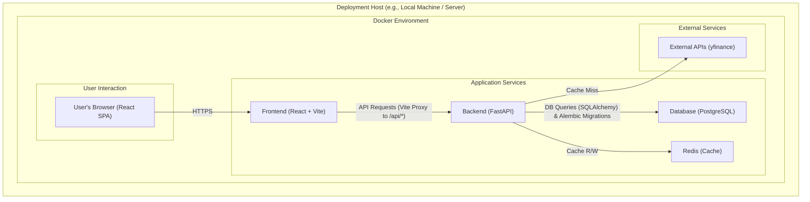

# System Architecture Document

This document outlines the high-level architecture for the Personal Portfolio Management System (PMS).

## 1. Architecture Diagram

The following diagram illustrates the components of the system and the flow of information.




## 2. Architectural Decisions

### 2.1. Architecture Pattern: Client-Server (SPA)

We will use a **decoupled Client-Server architecture**. The frontend will be a Single Page Application (SPA) that communicates with a backend via a RESTful API.

*   **Pros:** This pattern provides excellent separation of concerns, allows for independent development and scaling of the frontend and backend, and enables a modern, responsive user experience. It also allows the same API to be used by a future mobile application.

### 2.2. Technology Stack

*   **Backend:** **Python** with **FastAPI**. Chosen for its high performance, automatic data validation with Pydantic, and excellent ecosystem for data analysis and AI.
*   **Frontend:** **JavaScript** with **React**. Chosen for its component-based architecture, which is ideal for building complex UIs like our dashboard, and its vast ecosystem of libraries.
*   **Database:** **PostgreSQL**. Chosen for its reputation for reliability, data integrity (ACID compliance), and ability to handle complex queries, all of which are critical for a financial application.

### 2.3. Deployment Strategy

The entire application will be containerized using **Docker** and orchestrated with **Docker Compose**.

*   This creates a portable, self-contained application package that can be run on any machine with Docker installed, from a local development machine to a cloud server or a Raspberry Pi.
*   The setup will consist of three primary services: `backend`, `frontend`, and `db`.
*   A reverse proxy will manage incoming traffic, directing API calls to the backend and all other requests to the frontend.
*   This strategy directly supports the requirement for flexible deployment, including local offline use and self-hosting via services like Cloudflare Tunnels.

```