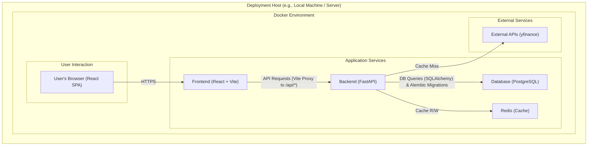

# System Architecture Document

This document outlines the high-level architecture for the Personal Portfolio Management System (PMS).

## 1. Architecture Diagram

The following diagram illustrates the components of the system and the flow of information.

```mermaid
graph TD
    subgraph "Deployment Host (e.g., Local Machine / Server)"
        subgraph "Docker Environment"
            direction LR
            subgraph "User Interaction"
                direction TB
                User_Browser["User's Browser (React SPA)"]
            end
            subgraph "Application Services"
                direction TB
                Frontend["Frontend (React + Vite)"]
                Backend["Backend (FastAPI)"]
                Database["Database (PostgreSQL)"]
                Redis["Redis (Cache)"]
            end
            subgraph "External Services"
                direction TB
                yfinance["External APIs (yfinance)"]
            end
            User_Browser -- HTTPS --> Frontend
            Frontend -- "API Requests (Vite Proxy to /api/*)" --> Backend
            Backend -- "DB Queries (SQLAlchemy) & Alembic Migrations" --> Database
            Backend -- "Cache R/W" --> Redis
            Backend -- "Cache Miss" --> yfinance
        end
    end
```

## 2. Architectural Decisions

### 2.1. Architecture Pattern: Client-Server (SPA)

We will use a **decoupled Client-Server architecture**. The frontend will be a Single Page Application (SPA) that communicates with a backend via a RESTful API.

*   **Pros:** This pattern provides excellent separation of concerns, allows for independent development and scaling of the frontend and backend, and enables a modern, responsive user experience. It also allows the same API to be used by a future mobile application.

### 2.2. Technology Stack

*   **Backend:** **Python** with **FastAPI**. Chosen for its high performance, automatic data validation with Pydantic, and excellent ecosystem for data analysis and AI.
*   **Frontend:** **JavaScript** with **React**. Chosen for its component-based architecture, which is ideal for building complex UIs like our dashboard, and its vast ecosystem of libraries.
*   **Database:** **PostgreSQL**. Chosen for its reputation for reliability, data integrity (ACID compliance), and ability to handle complex queries, all of which are critical for a financial application.

### 2.3. Deployment Strategy

The entire application will be containerized using **Docker** and orchestrated with **Docker Compose**.

*   This creates a portable, self-contained application package that can be run on any machine with Docker installed, from a local development machine to a cloud server or a Raspberry Pi.
*   The setup will consist of three primary services: `backend`, `frontend`, and `db`.
*   A reverse proxy will manage incoming traffic, directing API calls to the backend and all other requests to the frontend.
*   This strategy directly supports the requirement for flexible deployment, including local offline use and self-hosting via services like Cloudflare Tunnels.

### 2.4. Security & Sensitive Data Protection (`EncryptedString` Model)

To guarantee strict user data privacy on local single-user desktop deployments (PyInstaller) and mobile devices (Android SQLite), all sensitive PII and financial ledger fields are protected using field-level encryption:

*   **Custom SQLAlchemy Type Decorator:** `EncryptedString` (`backend/app/db/custom_types.py`) transparently encrypts data before database write and decrypts upon read using AES-256-GCM symmetric encryption keys managed by `KeyManager`.
*   **Key Persistence & Rotation:** Secret keys are generated and persisted locally in `secret.key` within the user's app data directory (`_get_app_dir()`), preventing unauthenticated decryption across application restarts.
*   **Encrypted Columns:** Applied to `IncomeSource.name`, `IncomeSource.payer_name`, `IncomeEntry.gross_amount`, `IncomeEntry.tds_amount`, `IncomeEntry.net_amount`, `IncomeEntry.notes`, `IncomeEntry.basic_amount`, `IncomeEntry.hra_amount`, `IncomeEntry.rent_paid`, `TaxDeduction.title`, `TaxDeduction.amount`, and `TaxDeduction.proof_notes`.

### 2.5. Tax Engine & Versioned Statutory Rules Registry

Tax analytics and regime estimations are driven by modular, decoupled services:

*   **Statutory Tax Rules Registry (`TaxRulesRegistry`):** `backend/app/core/tax_rules_registry.py` maintains year-over-year statutory rules for Financial Years 2021-22 through 2026-27 (tax slab brackets, standard deduction limits, Section 87A rebate ceilings, 4% Cess, and Section 80C/80D caps).
*   **Unrealized Tax Service (`UnrealizedTaxService`):** Computes lot-level unsold FIFO unrealized STCG/LTCG across equity, debt, foreign stocks, and mutual funds, pooling Section 112A equity LTCG exemption headroom (₹1,25,000 threshold/FY).
*   **Salary Exemption Service (`SalaryExemptionService`):** Enforces statutory Section 10(13A) HRA exemption rules with 100% mathematical parity against benchmark Excel tax calculators (`local/TaxCalc_2027.xlsx`).
*   **Dual Regime Tax Service (`TaxRegimeService`):** Aggregates gross income, TDS credits, Chapter VI-A deductions, and capital gains to compute net tax liability under the Old Tax Regime vs. New Tax Regime (Section 115BAC), exporting results with embedded legal non-advisory disclaimer banners (`MANDATORY_TAX_DISCLAIMER`).