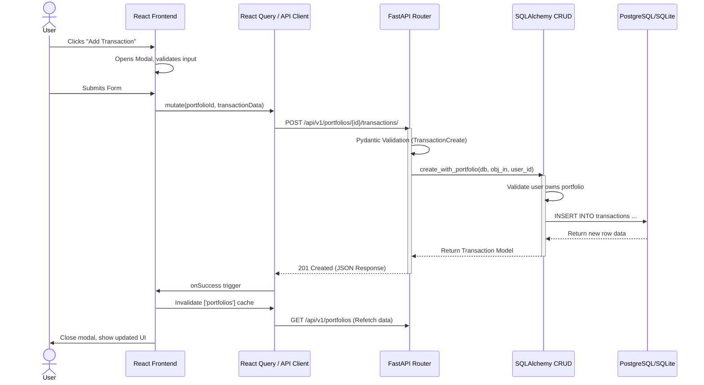
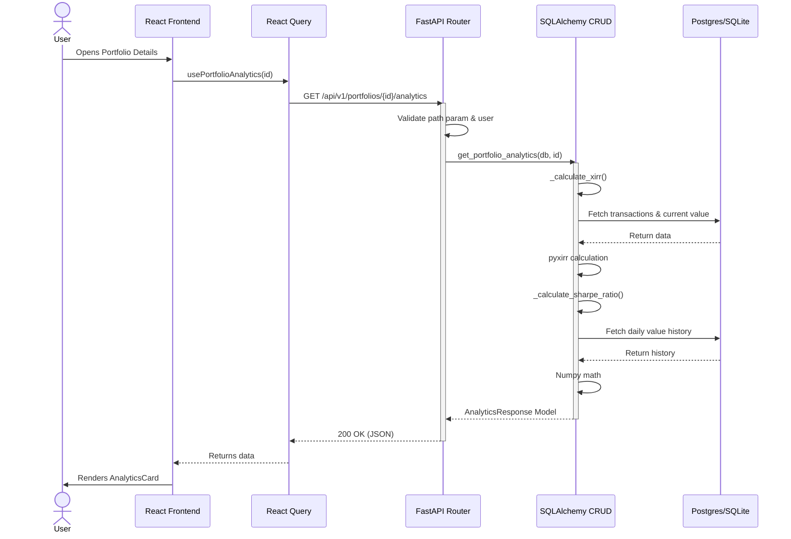
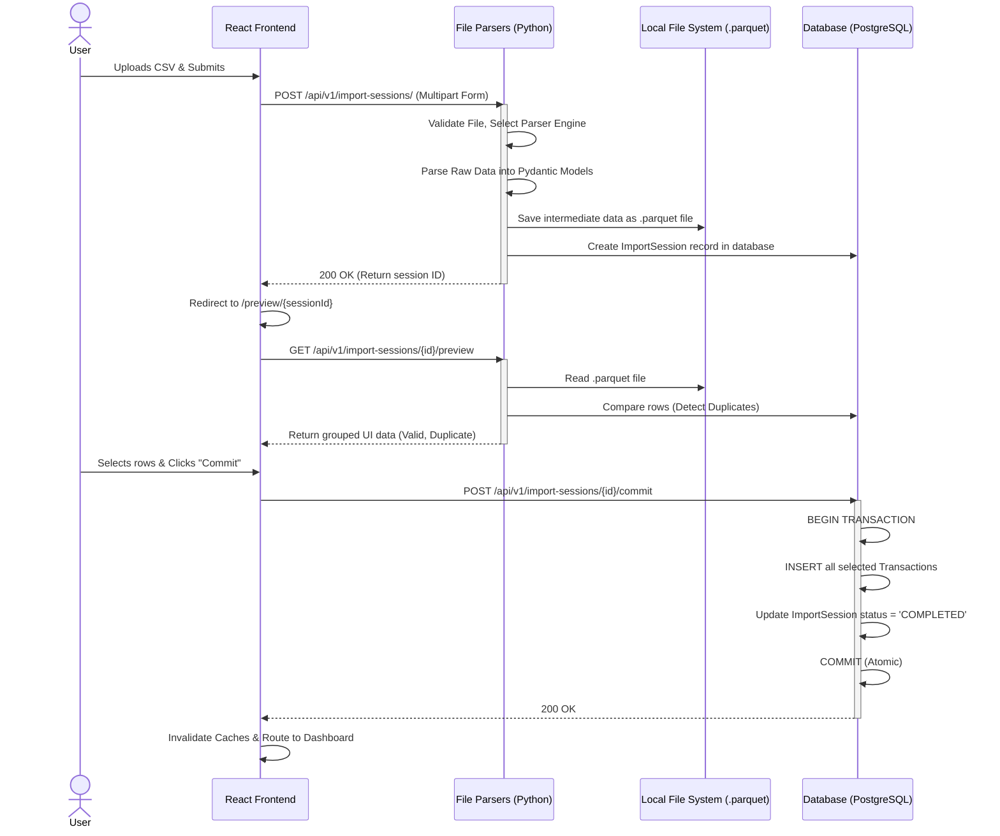
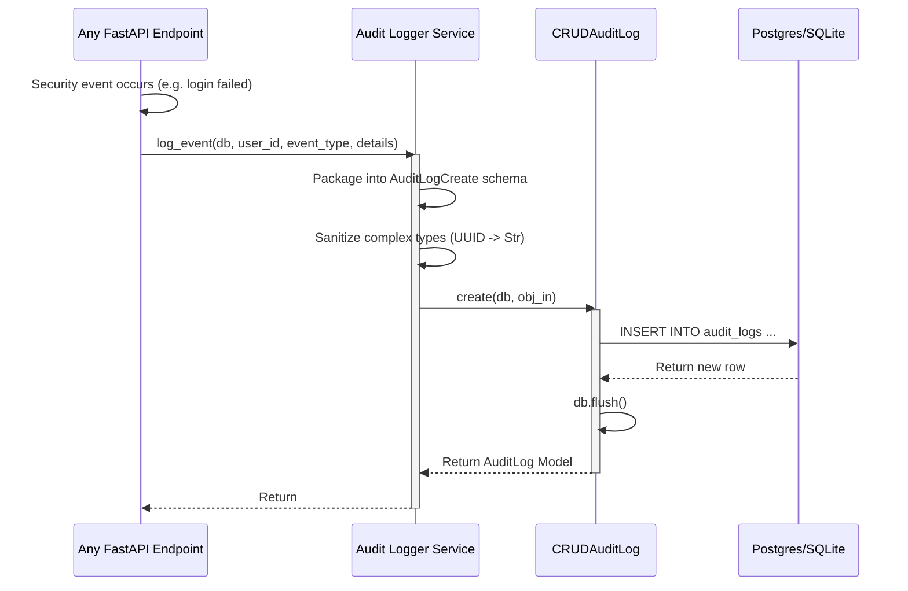
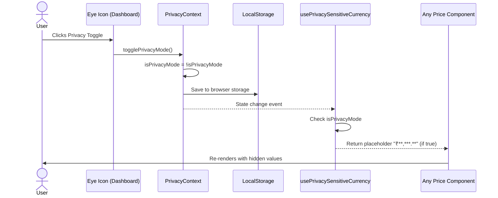
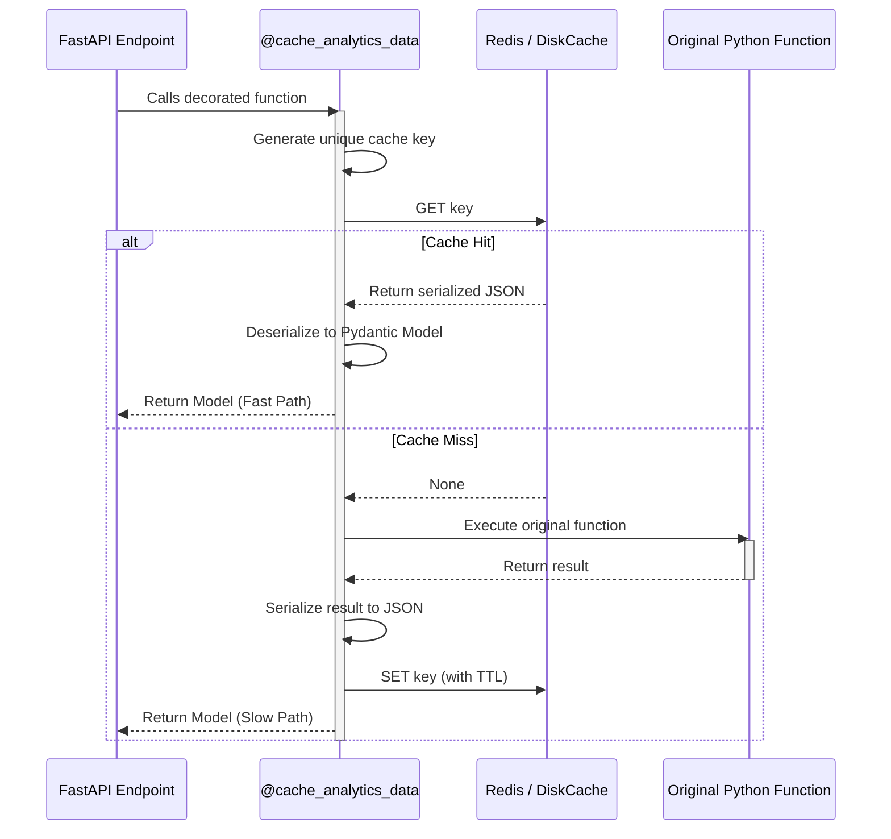
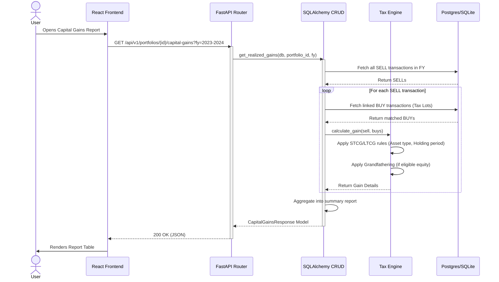
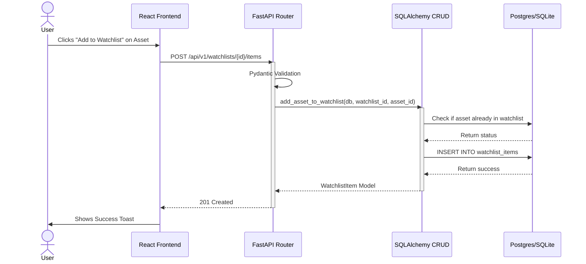
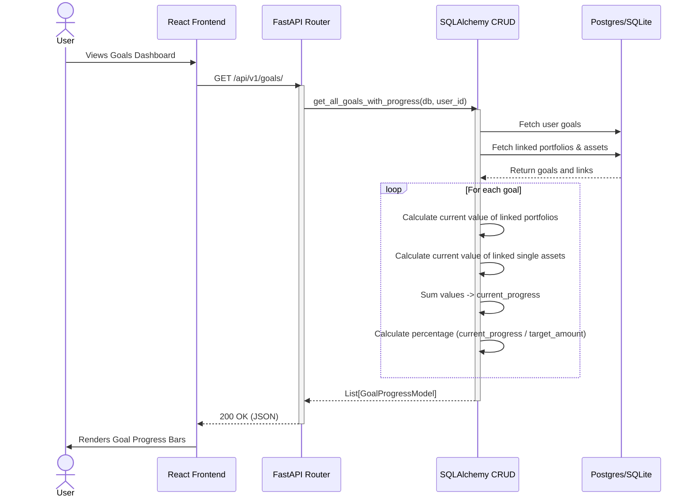

# Code Flow & Contribution Guide

This document provides a deep dive into the application's code structure and data flow. It's designed to help new contributors understand how the frontend and backend work together to deliver a feature.

### Deployment Architecture Context

ArthSaarthi is designed with a fundamentally decoupled architecture allowing it to run in three vastly different environments using the exact same core API code:

1.  **Docker Server (Multi-Tenant)**: The React frontend proxy routes API requests to the FastAPI backend running in a separate container, communicating via HTTP. Data is stored in PostgreSQL.
2.  **Electron Desktop (Standalone)**: The React frontend makes REST API calls to `localhost:8000`, which is served by a hidden PyInstaller-bundled executable of the FastAPI backend running native Python on the user's OS. Data is stored in a local SQLite file.
3.  **Android Mobile (Embedded)**: The React frontend runs in a Capacitor.js WebView and makes API calls to `localhost:<port>`, which is served by a Chaquopy-embedded instance of the FastAPI backend running entirely within the mobile app's background process. No internet connection is needed.

Regardless of *where* the code is running, the fundamental data flow described below remains identical.

---
We will trace a key user story: **Adding a new transaction to a portfolio.**

### Sequence Diagram: Adding a Transaction



---

## 1. Frontend Flow: Adding a Transaction

The user journey starts on the `PortfolioDetailPage`, where they click the "Add Transaction" button.

### Step 1: Opening the Modal (`PortfolioDetailPage.tsx`)

The page uses a simple `useState` hook to manage the visibility of the `AddTransactionModal`.

```typescriptreact
// frontend/src/pages/Portfolio/PortfolioDetailPage.tsx

const [isModalOpen, setModalOpen] = useState(false);

// ... later in the JSX
<button onClick={() => setModalOpen(true)} className="btn btn-primary">
    Add Transaction
</button>

{isModalOpen && (
    <AddTransactionModal
        onClose={() => setModalOpen(false)}
        portfolioId={portfolioId}
    />
)}
```

*   **Key Takeaway:** State for UI elements like modals is managed locally within the parent component.

### Step 2: Handling the Form (`AddTransactionModal.tsx`)

This component is responsible for user input, asset searching, and submitting the final data.

1.  **Form Management:** It uses `react-hook-form` for efficient form state management and validation.
2.  **Asset Search:** As the user types in the "Ticker" field, a debounced search is performed using the `lookupAsset` function from `portfolioApi.ts`.
3.  **Mutation with React Query:** When the form is submitted, it calls the `mutate` function from the `useCreateTransaction` custom hook (`usePortfolios.ts`). This hook wraps the actual API call.

```typescriptreact
// frontend/src/components/Portfolio/AddTransactionModal.tsx

const { mutate: createTransaction, isPending, error: apiError } = useCreateTransaction();

const onSubmit = (data: any) => {
    // ... data transformation logic
    createTransaction({ portfolioId, data: transactionData });
};
```

### Step 3: The API Service Layer (`portfolioApi.ts` & `usePortfolios.ts`)

*   `usePortfolios.ts`: This file defines all React Query hooks related to portfolios. The `useCreateTransaction` hook uses the `useMutation` hook from React Query to handle the API call's loading, error, and success states. It also handles cache invalidation on success.
*   `portfolioApi.ts`: This file contains the raw API call logic using an `apiClient` (an Axios instance). The `createTransaction` function here makes the actual `POST` request to the backend.

```typescript
// frontend/src/hooks/usePortfolios.ts
export const useCreateTransaction = () => {
  const queryClient = useQueryClient();
  return useMutation({
    mutationFn: ({ portfolioId, data }: { portfolioId: number; data: TransactionCreate }) =>
      portfolioApi.createTransaction(portfolioId, data),
    onSuccess: () => {
      // Invalidate caches to refetch data
      queryClient.invalidateQueries({ queryKey: ['portfolios'] });
    },
  });
};
```

---

## 2. Backend Flow: Creating a Transaction

The frontend's `POST` request to `/api/v1/portfolios/{portfolio_id}/transactions/` is handled by the FastAPI backend.

### Step 1: Routing & Dependencies (`endpoints/portfolios.py` & `endpoints/transactions.py`)

1.  The request first hits the router defined in `portfolios.py`, which includes the router from `transactions.py`.
2.  FastAPI uses its dependency injection system (`Depends`) to get the `current_user` from the JWT token and the `db` session.

### Step 2: Schema Validation (`schemas/transaction.py`)

The incoming JSON payload is automatically parsed and validated against the `TransactionCreate` Pydantic schema. If any fields are missing or have the wrong data type, FastAPI returns a `422 Unprocessable Entity` error immediately.

### Step 3: Business Logic (`crud/crud_transaction.py`)

The endpoint calls the `create_with_portfolio` method in the CRUD layer. This is where the core business logic resides.

1.  **Validation:** It first checks if the user owns the specified portfolio.
2.  **Validation:** It then performs critical business logic, such as checking if the user has sufficient holdings to make a `SELL` transaction.
3.  **Database Interaction:** If validation passes, it creates a new `Transaction` SQLAlchemy model instance and commits it to the database.

```python
# backend/app/crud/crud_transaction.py

def create_with_portfolio(self, db: Session, *, obj_in: TransactionCreate, portfolio_id: int, user_id: int) -> Transaction:
    # ... validation logic ...
    db_obj = self.model(**obj_in.model_dump(), portfolio_id=portfolio_id, user_id=user_id)
    db.add(db_obj)
    db.commit()
    db.refresh(db_obj)
    return db_obj

    # Note: Some endpoints, like transaction creation, have been updated to accept
    # a list of objects to support atomic, multi-transaction submissions (e.g., for
    # dividend reinvestment). The endpoint will loop through the list and process each item.
```

### Step 4: Response

The newly created `Transaction` object is returned from the CRUD layer, serialized by the `Transaction` Pydantic response schema, and sent back to the frontend as a JSON response with a `201 Created` status code.

---

This end-to-end flow demonstrates the separation of concerns and the clear path a request takes through the system, from user interaction to database persistence.

---

## 2. Frontend/Backend Flow: Displaying Portfolio Analytics

This trace follows the user journey for viewing advanced analytics (XIRR, Sharpe Ratio) on the `PortfolioDetailPage`.

### Sequence Diagram: Analytics Calculation



### Step 1: The View & Data Hook (`PortfolioDetailPage.tsx`)

The page uses the `usePortfolioAnalytics` custom React Query hook to fetch the analytics data. The hook's state (`analytics`, `isAnalyticsLoading`, `analyticsError`) is passed directly to the `AnalyticsCard` component for rendering.

```typescriptreact
// frontend/src/pages/Portfolio/PortfolioDetailPage.tsx

const { data: analytics, isLoading: isAnalyticsLoading, error: analyticsError } = usePortfolioAnalytics(portfolioId);

// ... later in the JSX
<AnalyticsCard analytics={analytics} isLoading={isAnalyticsLoading} error={analyticsError} />
```

### Step 2: The API Service Layer (`usePortfolios.ts` & `portfolioApi.ts`)

*   `usePortfolios.ts`: The `usePortfolioAnalytics` hook wraps the actual API call. It uses `useQuery` to handle caching, loading, and error states.
*   `portfolioApi.ts`: The `getPortfolioAnalytics` function makes the actual `GET` request to the backend endpoint.

```typescript
// frontend/src/hooks/usePortfolios.ts
export const usePortfolioAnalytics = (id: number) => {
    return useQuery<PortfolioAnalytics, Error>({
        queryKey: ['portfolioAnalytics', id],
        queryFn: () => portfolioApi.getPortfolioAnalytics(id),
        enabled: !!id,
    });
};
```

---

## 3. Backend Flow: Calculating Analytics

The frontend's `GET` request to `/api/v1/portfolios/{portfolio_id}/analytics` is handled by the FastAPI backend.

### Step 1: Routing & Dependencies (`endpoints/portfolios.py`)

The request hits the router in `portfolios.py`. FastAPI validates the path parameter (`portfolio_id`), gets the `current_user` from the JWT token, and checks that the user owns the requested portfolio.

### Step 2: Business Logic (`crud/crud_analytics.py`)

The endpoint calls the `get_portfolio_analytics` function. This is where the core business logic resides.

1.  **XIRR Calculation:** The `_calculate_xirr` helper function fetches all transactions and the portfolio's current market value to construct a series of cash flows, which are then passed to the `pyxirr` library.
2.  **Sharpe Ratio Calculation:** The `_calculate_sharpe_ratio` helper function fetches the portfolio's daily value history, calculates the daily returns, and then computes the Sharpe Ratio.

```python
# backend/app/crud/crud_analytics.py

def get_portfolio_analytics(db: Session, portfolio_id: int) -> AnalyticsResponse:
    xirr_value = _calculate_xirr(db=db, portfolio_id=portfolio_id)
    sharpe_ratio_value = _calculate_sharpe_ratio(db=db, portfolio_id=portfolio_id)
    return AnalyticsResponse(xirr=xirr_value, sharpe_ratio=sharpe_ratio_value)
```

### Step 3: Response & Schema Validation (`schemas/analytics.py`)

The calculated values are packaged into an `AnalyticsResponse` Pydantic model. FastAPI uses this model to serialize the data into a JSON response and send it back to the frontend with a `200 OK` status code.

---

## 4. Full-Stack Flow: Automated Data Import

This trace follows the user journey for importing a CSV of transactions.

### Sequence Diagram: Data Import Pipeline



### Step 1: Frontend - Upload (`DataImportPage.tsx` & `useImport.ts`)

1.  The user selects a portfolio, a statement type (e.g., "Zerodha Tradebook"), and a CSV file from their computer.
2.  On submission, the `useCreateImportSession` mutation hook (from `useImport.ts`) is called.
3.  This hook calls the `createImportSession` function in `importApi.ts`, which sends a `multipart/form-data` POST request to the backend.
4.  On a successful response, the user is automatically navigated to the preview page using the `sessionId` returned from the backend.

### Step 2: Backend - Parsing & Staging (`endpoints/import_sessions.py`)

The `POST /api/v1/import-sessions/` endpoint orchestrates the first half of the import process.

1.  **File Storage:** The uploaded file is securely saved to a temporary directory.
2.  **Parser Selection:** The `source_type` from the form data is passed to a `ParserFactory`. The factory returns the appropriate parser instance (e.g., `ZerodhaParser`, `IciciParser`).
3.  **Parsing:** The `parser.parse(df)` method is called, which converts the CSV data into a list of `ParsedTransaction` Pydantic models.
4.  **Sorting:** The list of `ParsedTransaction` objects is immediately sorted by date, ticker, and type (BUY then SELL). This is a critical step to ensure data integrity and prevent commit failures from out-of-order source data.
5.  **Staging:** The sorted list of transactions is saved to a `.parquet` file, a highly efficient binary format. The path to this file is stored in the `ImportSession` database record. The session status is updated to `PARSED`.

### Step 3: Frontend - Preview & Selection (`ImportPreviewPage.tsx`)

1.  The preview page uses the `sessionId` from the URL to call the `useImportSessionPreview` query hook.
2.  This hook fetches data from the `GET /api/v1/import-sessions/{sessionId}/preview` backend endpoint.
3.  The backend reads the staged `.parquet` file, compares each transaction against the database to categorize it (`valid_new`, `duplicate`, `invalid`), and returns the categorized data.
4.  The frontend renders the transactions in collapsible sections. The user can select which of the `valid_new` transactions they wish to commit using checkboxes.

### Step 4: Backend - Commit (`endpoints/import_sessions.py`)

1.  When the user clicks "Commit", the frontend calls the `useCommitImportSession` mutation hook.
2.  This sends a `POST` request to `POST /api/v1/import-sessions/{sessionId}/commit` with a payload containing the list of transactions the user selected.
3.  The backend endpoint iterates through the selected transactions. For each one, it creates a `Transaction` database record using `crud.transaction.create_with_portfolio`.
4.  The entire operation is wrapped in a single database transaction. If all transactions are created successfully, the session status is updated to `COMPLETED` and the changes are committed.
5.  If any error occurs, the entire transaction is rolled back, ensuring the database is not left in a partially updated state.

---

## 5. Cross-Cutting Concern: Audit Logging

The Audit Logging Engine is a cross-cutting concern that is invoked from various parts of the application. It provides a centralized way to record security-sensitive events.

### Sequence Diagram: Audit Event Flow



### Step 1: Event Trigger (e.g., `endpoints/auth.py`)

An auditable event occurs within an API endpoint. For example, a user attempts to log in.

```python
# backend/app/api/v1/endpoints/auth.py

@router.post("/login/access-token")
def login_access_token(...):
    user = crud.user.authenticate(...)
    if not user:
        # Log the failed attempt
        log_event(db, event_type="USER_LOGIN_FAILURE", ...)
        raise HTTPException(...)

    # Log the successful attempt
    log_event(db, user_id=user.id, event_type="USER_LOGIN_SUCCESS", ...)
    return {"access_token": ..., "token_type": "bearer"}
```

### Step 2: The Logging Service (`services/audit_logger.py`)

The endpoint calls the `log_event` function. This service acts as the single point of entry for all audit logging.

1.  **Schema Creation:** It takes the raw data (user ID, event type, IP address, details) and packages it into an `AuditLogCreate` Pydantic schema.
2.  **Data Sanitization:** It ensures that any complex data types (like UUIDs in the `details` dictionary) are converted to JSON-serializable formats (like strings) before being passed to the database layer.

### Step 3: Database Interaction (`crud/crud_audit_log.py`)

The `log_event` service calls the `create` method in the `CRUDAuditLog` module. This CRUD class is responsible for the direct database interaction. It creates an `AuditLog` SQLAlchemy model instance and commits it to the `audit_logs` table in the database.

```python
# backend/app/crud/crud_audit_log.py

class CRUDAuditLog(CRUDBase[AuditLog, AuditLogCreate, AuditLogUpdate]):
    def create(self, db: Session, *, obj_in: AuditLogCreate) -> AuditLog:
        # ... logic to create the db_obj ...
        db.add(db_obj)
        db.flush() # Flush to get the ID without committing the full transaction
        return db_obj
```

*   **Key Takeaway:** The flow is designed to be simple and decoupled. API endpoints don't need to know about the database schema; they just call a central service. The service handles the business logic of preparing the log entry, and the CRUD layer handles the raw database operation. This makes it easy to add new audit events anywhere in the application with a single function call.

---

## 6. Cross-Cutting Concern: Privacy Mode

Privacy Mode is a global, client-side feature that allows users to obscure sensitive data. It demonstrates a simple but effective use of React Context for global state management.

### Sequence Diagram: Toggling Privacy



### Step 1: State Management (`context/PrivacyContext.tsx`)

1.  **Context Creation:** A `PrivacyContext` is created to hold the global state, which is a simple boolean `isPrivacyMode`.
2.  **Provider Logic:** The `PrivacyProvider` component manages the state using a `useState` hook.
3.  **Persistence:** A `useEffect` hook is used to synchronize the `isPrivacyMode` state with the browser's `localStorage`. This ensures the user's preference is remembered across sessions.
4.  **Custom Hook:** A `usePrivacy` custom hook is exported to provide easy and type-safe access to the context's value (`isPrivacyMode` and `togglePrivacyMode`).

### Step 2: Global Integration (`main.tsx`)

The entire application is wrapped in the `PrivacyProvider` in `main.tsx`. This makes the privacy state available to every component in the tree.

### Step 3: The UI Toggle (`pages/DashboardPage.tsx`)

The eye icon toggle button on the dashboard is the primary UI for this feature.

1.  It calls the `usePrivacy` hook to get the current `isPrivacyMode` state and the `togglePrivacyMode` function.
2.  It conditionally renders either the `EyeIcon` or `EyeSlashIcon` based on the boolean state.
3.  The `onClick` handler simply calls `togglePrivacyMode`.

### Step 4: Conditional Formatting (`utils/formatting.ts`)

To avoid applying privacy to all monetary values, a specific hook was created.

1.  **`usePrivacySensitiveCurrency` Hook:** This new hook was created in `formatting.ts`.
2.  **Logic:** It calls `usePrivacy()` to check `isPrivacyMode`. If `true`, it returns a function that always returns the placeholder `₹**,***.**`. If `false`, it returns the original `formatCurrency` function.
3.  **Usage:** This hook is then called *only* in components that display high-level, sensitive data (e.g., `SummaryCard.tsx`), ensuring that less sensitive data (like individual asset prices in a table) remains visible.

---

## 7. Cross-Cutting Concern: Analytics Caching

The Analytics Caching engine is a cross-cutting concern designed to improve application performance by storing the results of expensive calculations.

### Sequence Diagram: Cache Evaluation



### Step 1: The Cache Decorator (`cache/utils.py`)

The core of the caching engine is the `@cache_analytics_data` decorator. It is applied to expensive, read-only CRUD functions.

```python
# backend/app/crud/crud_holding.py

class CRUDHolding:
    @cache_analytics_data(
        prefix="analytics:portfolio_holdings_and_summary",
        arg_names=["portfolio_id"],
        response_model=schemas.PortfolioHoldingsAndSummary,
    )
    def get_portfolio_holdings_and_summary(self, db: Session, *, portfolio_id: uuid.UUID):
        # ... expensive calculation logic ...
```

1.  **Key Generation:** The decorator generates a unique cache key by combining the `prefix` and the value of the function argument specified in `arg_names` (e.g., `analytics:portfolio_holdings_and_summary:some-uuid`).
2.  **Cache Check:** It checks the Redis cache for this key. If a value is found, it is deserialized (using the optional `response_model` if provided) and returned immediately, skipping the function execution.
3.  **Function Execution & Caching:** If the key is not found (a "cache miss"), the original function is executed. Its result is then serialized to JSON and stored in Redis with a 15-minute TTL before being returned.

### Step 2: Cache Invalidation (`cache/utils.py`)

To prevent stale data, the cache must be cleared whenever underlying data changes. This is handled by the `invalidate_caches_for_portfolio` function.

```python
# backend/app/api/v1/endpoints/bonds.py

@router.post("/", response_model=Bond, status_code=status.HTTP_201_CREATED)
def create_bond(...):
    # ... logic to create bond and transaction ...

    # Invalidate caches for the affected portfolio
    cache_utils.invalidate_caches_for_portfolio(db=db, portfolio_id=portfolio_id)

    return new_bond
```

This function is called from any API endpoint that creates, updates, or deletes data for a portfolio (e.g., creating a transaction, importing a file, adding a bond). It constructs and deletes all cache keys associated with that `portfolio_id` and its `user_id`, ensuring that the next request will trigger a fresh calculation.

---

## 8. Feature Flow: Capital Gains Calculation

The Capital Gains engine calculates realized gains based on Specific Lot Identification (Tax Lots) or FIFO.

### Sequence Diagram: Capital Gains



---

## 9. Feature Flow: Watchlist Management

Watchlists allow users to track assets without owning them in a portfolio.

### Sequence Diagram: Adding to Watchlist



---

## 10. Feature Flow: Goal Planning

Goal Planning allows users to create financial targets and link portfolios/assets to them.

### Sequence Diagram: Calculating Goal Progress



---

## 11. Background Task: Daily Portfolio Snapshot

To ensure the Dashboard's historical chart loads instantly without recalculating years of history on every request, the system pre-computes the portfolio value at the end of each day. 

Because the Desktop and Android apps do not run continuously on a server 24/7, a traditional cron job is not used. Instead, a lightweight `asyncio` background task is spawned when the FastAPI app starts up in Desktop mode.

### Sequence Diagram: Desktop Snapshot Loop

```mermaid
sequenceDiagram
    participant App as FastAPI App (main.py)
    participant Loop as _desktop_snapshot_loop
    participant Executor as ThreadPoolExecutor
    participant Service as take_daily_snapshots_for_all
    participant DB as Postgres/SQLite

    App->>Loop: asyncio.create_task() on Startup
    activate Loop
    Loop->>Loop: asyncio.sleep(10) (Wait for init)
    
    loop Every 6 Hours (21600s)
        Loop->>Executor: run_in_executor(take_daily_snapshots_for_all)
        activate Executor
        
        Executor->>Service: Call holding & valuation logic
        activate Service
        
        Service->>DB: Fetch active portfolios
        
        loop For each Portfolio
            Service->>Service: Calculate missing snapshot days (Catch-up)
            Service->>DB: Fetch transactions & reconstruct holdings
            Service->>Service: Get closing prices (yfinance) or evaluate formulas (FDs)
            Service->>DB: UPSERT INTO daily_portfolio_snapshots
        end
        
        Service-->>Executor: Return count of updated snapshots
        deactivate Service
        
        Executor-->>Loop: Complete
        deactivate Executor
        Loop->>Loop: asyncio.sleep(21600)
    end
```

### Catch-up Logic
When the application starts, it checks the database for the last generated snapshot. If the user hasn't opened the application in several days, the `take_daily_snapshots_for_all` service acts as a "catch-up" mechanism, generating snapshots for all the missed days sequentially. This ensures seamless historical charts regardless of how infrequently the app is launched.
