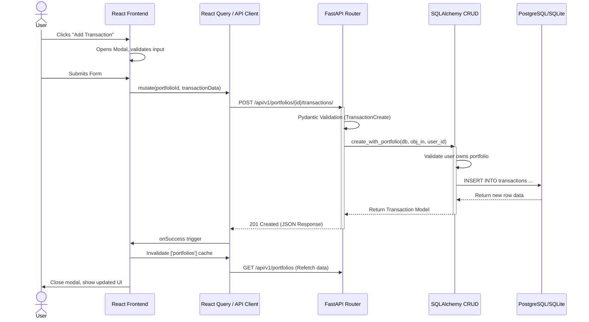
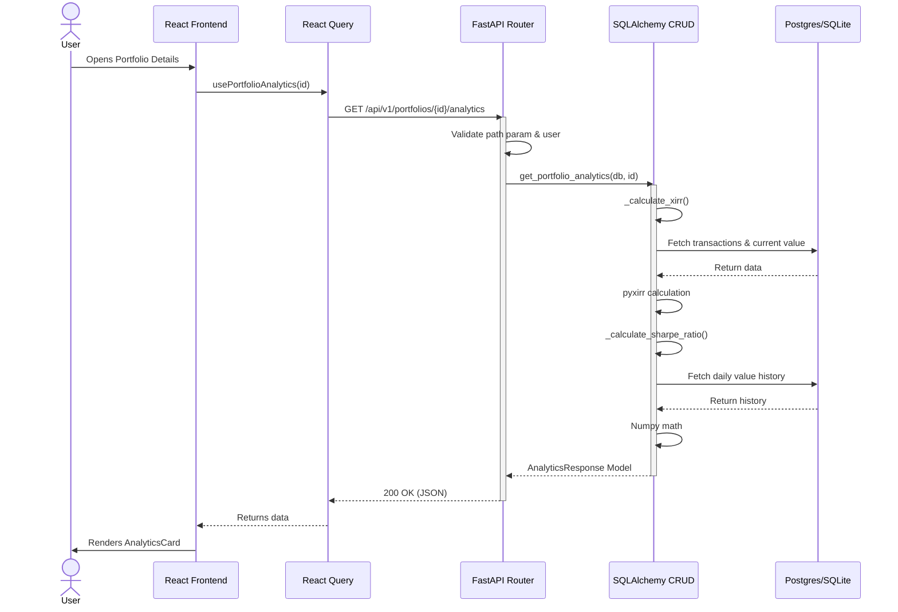
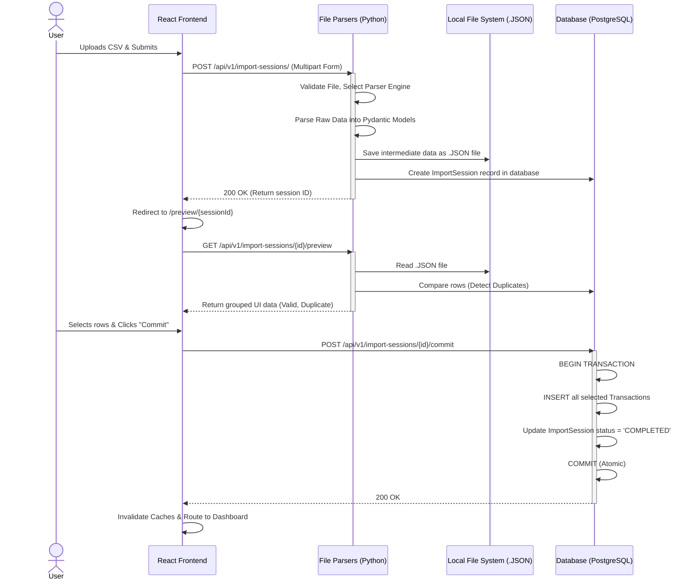

# Code Flow Guide

This document provides a deep dive into the application's code structure and data flow. It's designed to help new contributors understand how the frontend and backend work together to deliver a feature.

### Deployment Architecture Context

ArthSaarthi is designed with a fundamentally decoupled architecture allowing it to run in two vastly different environments using the exact same core API code:

1.  **Docker Server (Multi-Tenant)**: The React frontend proxy routes API requests to the FastAPI backend running in a separate container, communicating via HTTP. Data is stored in PostgreSQL.
2.  **Electron Desktop (Standalone)**: The React frontend makes REST API calls to `localhost:8000`, which is served by a hidden PyInstaller-bundled executable of the FastAPI backend running native Python on the user's OS. Data is stored in a local SQLite file.

Regardless of *where* the code is running, the fundamental data flow described below remains identical.

---
We will trace a key user story: **Adding a new transaction to a portfolio.**

### Sequence Diagram: Adding a Transaction



---

## 1. Frontend Flow: Adding a Transaction

### Step 1: The UI and State (`TransactionFormModal.tsx`)

1.  The user interacts with a React form (built using `react-hook-form`).
2.  Input validation (e.g., ensuring quantity is positive) occurs on the client side using **Zod** schemas.
3.  Upon clicking "Save," the form data is passed to a transition mutation.

### Step 2: The Data Hook (`usePortfolios.ts`)

1.  We use **React Query**'s `useMutation` hook to handle the asynchronous API call.
2.  The hook uses an `axios` instance (configured with the base URL and JWT token) to send a `POST` request to the backend.
3.  **Vite Proxy (Server Mode):** In development or multi-tenant mode, Vite proxies requests from `/api/*` to the backend container.
4.  **Localhost (Desktop Mode):** In desktop mode, requests are sent directly to `http://localhost:8000`.

---

## 2. Backend Flow: Adding a Transaction

### Step 1: Routing and Validation (`api/v1/endpoints/transactions.py`)

1.  **FastAPI Router:** Receives the `POST` request.
2.  **Dependency Injection:** The `get_db` dependency provides a SQLAlchemy session, and `get_current_active_user` ensures the request is authenticated.
3.  **Pydantic Validation:** The request body is automatically validated against the `TransactionCreate` schema.

### Step 2: CRUD Logic (`crud/crud_transaction.py`)

1.  The `create_with_portfolio` method is called.
2.  **Ownership Check:** The system verifies that the specified `portfolio_id` belongs to the `current_user`.
3.  **Database Storage:** A new `models.Transaction` object is created and added to the SQLAlchemy session. `db.commit()` persists the data.
4.  **Relationships:** SQLAlchemy automatically handles the foreign key relationships between Transactions, Portfolios, and Assets.

### Step 3: Response and Cache Invalidation

1.  The backend returns the newly created transaction as a JSON object, validated against the `Transaction` schema.
2.  **Frontend Cache Invalidation:** Upon a successful `201 Created` response, the React Query `onSuccess` callback invalidates the `['portfolios']` and `['holdings']` query keys.
3.  This triggers an automatic background refetch of the portfolio data, ensuring the UI (e.g., the Holdings Table) reflects the new transaction immediately.

---

## 3. Analytics Flow: Portfolio Performance

This trace follows the user journey for viewing advanced analytics (XIRR, Sharpe Ratio) on the `PortfolioDetailPage`.

### Sequence Diagram: Analytics Calculation



### Step 1: The View & Data Hook (`PortfolioDetailPage.tsx`)

The page uses the `usePortfolioAnalytics` custom React Query hook to fetch the analytics data. The hook's state (`analytics`, `isAnalyticsLoading`, `analyticsError`) is passed directly to the `AnalyticsCard` component for rendering.

### Step 2: The Calculation Logic (`crud/crud_analytics.py`)

1.  **XIRR Calculation:** The `_calculate_xirr` function gathers all cash flows (BUYs as outflows, SELLs and Dividends as inflows, current market value as a final inflow) and uses the `pyxirr` library to find the internal rate of return.
2.  **Sharpe Ratio Calculation:**
    -   The system fetches the historical daily value of the portfolio from the `daily_portfolio_snapshots` table.
    -   It calculates daily returns using `numpy`.
    -   It computes the ratio of excess return (over a configurable risk-free rate) to the standard deviation of returns.

---

## 4. Feature Flow: Data Import Pipeline

This trace follows the user journey for importing a CSV/PDF of transactions.

### Sequence Diagram: Data Import Pipeline



---

## 5. Feature Flow: Background Task (Daily Snapshots)

### Sequence Diagram: Desktop Snapshot Loop

```mermaid
sequenceDiagram
    participant App as FastAPI App (main.py)
    participant Loop as _desktop_snapshot_loop
    participant Executor as ThreadPoolExecutor
    participant Service as take_daily_snapshots_for_all
    participant DB as Postgres/SQLite

    App->>Loop: asyncio.create_task() on Startup
    activate Loop
    Loop->>Loop: asyncio.sleep(10) (Wait for init)
    
    loop Every 6 Hours (21600s)
        Loop->>Executor: run_in_executor(take_daily_snapshots_for_all)
        activate Executor
        
        Executor->>Service: Call holding & valuation logic
        activate Service
        
        Service->>DB: Fetch active portfolios
        
        loop For each Portfolio
            Service->>Service: Calculate missing snapshot days (Catch-up)
            Service->>DB: Fetch transactions & reconstruct holdings
            Service->>Service: Get closing prices (yfinance) or evaluate formulas (FDs)
            Service->>DB: UPSERT INTO daily_portfolio_snapshots
        end
        
        Service-->>Executor: Return count of updated snapshots
        deactivate Service
        
        Executor-->>Loop: Complete
        deactivate Executor
        Loop->>Loop: asyncio.sleep(21600)

---

## 6. Calculation Flow: Tax Lot (FIFO/Specific ID) Resolution

This sequence diagram illustrates how the system calculates remaining holdings and capital gains.

```mermaid
sequenceDiagram
    participant UI as Frontend (HoldingDetailModal)
    participant API as Backend (Transactions API)
    participant DB as Database (Postgres/SQLite)

    UI->>API: GET /portfolios/{id}/assets/{asset_id}/transactions
    API->>DB: Query Transactions + SellLinks
    DB-->>API: Return transaction history
    API-->>UI: Return transaction list with sell_links

    Note over UI: Frontend Logic (useMemo)
    UI->>UI: 1. Sort by Date (ASC)
    UI->>UI: 2. Filter Acquisition Types (BUY, RSU, ESPP)
    UI->>UI: 3. Apply Demerger Cost Adjustments (if any)
    UI->>UI: 4. Consume BUY lots using SellLinks (Specific ID)
    UI->>UI: 5. Consume remaining SELL qty using FIFO
    UI->>UI: 6. Calculate CAGR per remaining lot

    UI->>UI: Render Open Lots
```
