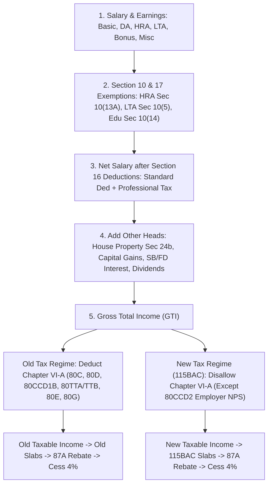

# Feature Specification: Structured Tax Summary Report & Tax Profile Dashboard (FR16.4)

**Feature ID:** FR16.4  
**Status:** 📝 Planned  
**Title:** Structured Tax Summary Report & Old vs New Regime Comparison Engine  
**GitHub Issue:** [#519](https://github.com/aashishbhanawat/ArthSaarthi/issues/519)  
**Reference Benchmark:** Excel Salary Tax Calculator (`local/TaxCalc_2027.xlsx`)  
**User Story:** As a user planning my annual taxes, I want a consolidated Financial Year Tax Readiness summary report, so that I can view my overall tax profile, gross income, TDS credits, eligible deductions, capital gains, and estimated net tax liability compared under both Old and New Tax Regimes.

---

## 1. Sub-Task Breakdown & Implementation Modules

1. **Module 1.1 (Versioned Tax Rules Registry):** Configurable, versioned statutory tax rule engine (`backend/app/core/tax_rules_registry.py`) storing year-over-year tax brackets, standard deductions, Section 87A rebates, HRA formulas, and deduction eligibility per Financial Year (benchmarked against `local/TaxCalc_2027.xlsx`).
2. **Module 1.2 (Salary & Allowances Exemptions Engine):** Calculates HRA exemption (Sec 10(13A)), Standard Deduction (Sec 16(ia) - ₹50k Old / ₹75k New), Professional Tax (Sec 16(iii)), LTA (Sec 10(5)), Children Education Allowance (Sec 10(14)), and Employer NPS (Sec 80CCD(2)).
3. **Module 1.3 (Dual Regime Calculator):** Tax computation service (`TaxRegimeService`) computing Old Regime (with Chapter VI-A deductions: 80C, 80D, 80CCD1B, 80TTA/TTB, 80E, 80G, Sec 24b Home Loan) vs New Regime (Section 115BAC - without Chapter VI-A, with 87A rebate & ₹75k Standard Deduction).
4. **Module 1.4 (Backend API & Exporters):** API endpoint `GET /api/v1/tax/summary` and structured PDF/CSV export builders with legal disclaimers.
5. **Module 1.5 (Frontend UI):** `TaxSummaryDashboard.tsx`, Old vs New Regime side-by-side comparison card, and FY selector dropdown.

---

## 2. Tax Computation Architecture & Benchmark Analysis (`local/TaxCalc_2027.xlsx`)

### 2.1. Salary Income, Allowance Exemptions & Deductions Pipeline

Based on the industry-standard salary tax model in `local/TaxCalc_2027.xlsx`, ArthSaarthi's tax calculation pipeline processes income and deductions in 6 stages:



---

### 2.2. HRA Exemption Math (Section 10(13A))
As implemented in `TaxCalc_2027.xlsx` Sheet `IT 2026-27` Row 52, HRA exemption is calculated as:
$$\text{HRA Exemption} = \min\Big(\text{Actual HRA Received}, \text{Rent Paid} - 10\% \times (\text{Basic} + \text{DA}), \text{Metro\%} \times (\text{Basic} + \text{DA})\Big)$$
*   **Metro City (Mumbai, Delhi, Kolkata, Chennai):** $50\%$ of (Basic + DA)
*   **Non-Metro City:** $40\%$ of (Basic + DA)

---

### 2.3. Old vs New Tax Regime Rules Matrix

| Component | Old Tax Regime | New Tax Regime (Section 115BAC) | Benchmarked in Excel (`TaxCalc_2027.xlsx`) |
|---|---|---|---|
| **Standard Deduction (Sec 16(ia))** | ₹50,000 | **₹75,000** (FY 2024-25 / 2025-26 Budget revision) | Row 54 (`=IF(AB71="N",MIN(F53,50000)...)`) |
| **Professional Tax (Sec 16(iii))** | ✅ Allowed | ❌ Disallowed | Row 55 |
| **HRA Exemption (Sec 10(13A))** | ✅ Allowed | ❌ Disallowed | Row 52 |
| **Section 80C (PPF, ELSS, EPF, LIC, Housing Principal)** | ✅ Allowed (Up to ₹1,50,000) | ❌ Disallowed | Row 67 & Row 79 |
| **Section 80D (Health Insurance / Checkups)** | ✅ Allowed (₹25k/₹50k Self + ₹25k/₹50k Parents) | ❌ Disallowed | Row 67 & Row 68 |
| **Section 80CCD(1B) (NPS Employee Addl.)** | ✅ Allowed (Up to ₹50,000) | ❌ Disallowed | Row 80 |
| **Section 80CCD(2) (NPS Employer Contribution)** | ✅ Allowed (Up to 10%/14% Basic) | ✅ **Allowed** (Retained in New Regime) | Row 87 |
| **Section 80TTA / 80TTB (Savings/Deposit Interest)** | ✅ Allowed (₹10,000 / ₹50,000) | ❌ Disallowed | Row 75 |
| **Section 24(b) (Home Loan Interest - Self Occupied)** | ✅ Allowed (Up to ₹2,00,000 loss) | ❌ Disallowed for Self-Occupied | Row 69 |
| **Section 87A Tax Rebate** | Full rebate if taxable income $\le ₹5,00,000$ | Full rebate if taxable income $\le ₹7,00,000 / ₹7,50,000$ | Row 74 |
| **Surcharge & Cess** | 4% Cess + Surcharge (>₹50L) | 4% Cess + Surcharge (>₹50L, max 25%) | Row 76 & Row 77 |

---

### 2.4. Year-over-Year Versioned Tax Rules Registry (`TaxRulesRegistry`)

To support past, current (`TaxCalc_2027.xlsx`), and future financial years seamlessly, the system uses `TaxRulesRegistry` (`backend/app/core/tax_rules_registry.py`):

```python
class FinancialYearTaxRules(BaseModel):
    financial_year: str  # e.g. "2024-2025", "2025-2026", "2026-2027"
    old_regime_standard_deduction: Decimal = Decimal("50000.00")
    new_regime_standard_deduction: Decimal = Decimal("75000.00")
    section_87a_old_limit: Decimal = Decimal("500000.00")
    section_87a_new_limit: Decimal = Decimal("750000.00")
    old_regime_slabs: List[Tuple[Decimal, Optional[Decimal], Decimal]]
    new_regime_slabs: List[Tuple[Decimal, Optional[Decimal], Decimal]]
    health_and_education_cess_rate: Decimal = Decimal("0.04")

TAX_RULES_REGISTRY: Dict[str, FinancialYearTaxRules] = {
    "2026-2027": FinancialYearTaxRules(
        financial_year="2026-2027",
        old_regime_standard_deduction=Decimal("50000.00"),
        new_regime_standard_deduction=Decimal("75000.00"),
        section_87a_old_limit=Decimal("500000.00"),
        section_87a_new_limit=Decimal("750000.00"),
        old_regime_slabs=[
            (Decimal("0"), Decimal("250000"), Decimal("0.00")),
            (Decimal("250000"), Decimal("500000"), Decimal("0.05")),
            (Decimal("500000"), Decimal("1000000"), Decimal("0.20")),
            (Decimal("1000000"), None, Decimal("0.30")),
        ],
        new_regime_slabs=[
            (Decimal("0"), Decimal("300000"), Decimal("0.00")),
            (Decimal("300000"), Decimal("700000"), Decimal("0.05")),
            (Decimal("700000"), Decimal("1000000"), Decimal("0.10")),
            (Decimal("1000000"), Decimal("1200000"), Decimal("0.15")),
            (Decimal("1200000"), Decimal("1500000"), Decimal("0.20")),
            (Decimal("1500000"), None, Decimal("0.30")),
        ]
    )
}
```

---

## 3. Test Plan & Corner Cases

### 3.1. Corner Cases
* **Excel Benchmark Alignment:** Cross-verify calculated tax liability against `local/TaxCalc_2027.xlsx` for test salary profiles (Basic ₹10L, HRA ₹4L, Rent ₹3.6L, 80C ₹1.5L, 80D ₹25k).
* **Section 87A Rebate Thresholds:** Full rebate applied when taxable income is $\le ₹7.5\text{L}$ in New Regime.
* **Employer NPS (80CCD(2)):** Allowed in BOTH Old and New Regimes up to 10% of Basic.
* **Self-Occupied Home Loan Interest (Sec 24b):** Deducted in Old Regime (up to ₹2.0L), strictly disallowed in New Regime.

### 3.2. Manual Testing Matrix
* [ ] Input salary components matching `TaxCalc_2027.xlsx`.
* [ ] Verify Old vs New Regime outputs match Excel results to the exact rupee.
* [ ] Confirm "Recommended Regime" badge highlights the lower tax option.
* [ ] Verify PDF/CSV exports include mandatory non-advisory legal disclaimers.

---

## 4. Test Automation Plan

* **Backend Tests (`app/tests/api/v1/test_tax_summary.py`):** Benchmark integration tests comparing `TaxRegimeService` calculations against `TaxCalc_2027.xlsx` reference cases.
* **Frontend Tests (`src/components/RegimeComparisonCard.test.tsx`):** Unit tests for side-by-side card rendering.
* **E2E Tests (`tests/tax-readiness-workflow.spec.ts`):** E2E test verifying tax summary dashboard navigation and report export download.

---

## 5. UX & UI Specifications

* **Comparison Cards:** Side-by-side dual card layout comparing Old Regime vs New Regime.
* **Legal Disclaimer Banner:** Mandatory non-advisory disclaimer banner:
  > *Disclaimer: This report is generated for informational tax planning purposes only and does not constitute formal financial or tax advice.*

---

## 6. Database Schema & Security Encryption (`EncryptedString`)

* Aggregates data from encrypted `IncomeEntry`, `TaxDeduction`, `Transaction`, and `Holding` tables.
* Decrypts values dynamically in memory for tax calculation and report generation without persisting unencrypted temporary files.

---

## 7. Documentation Updates Roadmap

* **`docs/code_flow_guide.md` & `docs/architecture.md`**: Document `TaxRulesRegistry` and `TaxRegimeService`.
* **`docs/workflow_history.md`**: Log implementation entry.
* **`docs/project_handoff_summary.md`**: Update status and test counts.
* **`docs/requirements.md`**: Mark `FR16.4` as `✅ Done`.

---

## 8. Data Sources Required

* Versioned statutory tax rule registry (`TaxRulesRegistry`).
* Cost Inflation Index (CII) table (Sheet `Cost Inflation Index` in `TaxCalc_2027.xlsx`).
* Health & Education Cess rate (4%).

---

## 9. Files & APIs to Create / Update

* `backend/app/core/tax_rules_registry.py` (New - Versioned Tax Rule Engine)
* `backend/app/services/tax_regime_service.py` (New - Dual Regime Calculator)
* `backend/app/schemas/tax_summary.py` (New)
* `backend/app/api/v1/endpoints/tax_summary.py` (New)
* `frontend/src/pages/TaxSummaryDashboard.tsx` (New)
* `frontend/src/components/RegimeComparisonCard.tsx` (New)
* `backend/app/tests/api/v1/test_tax_summary.py` (New)

---

## 10. Mobile-Friendly UI

* Dual comparison cards stack vertically on mobile screens (`< 1024px`).
* `pt-safe` and `pb-safe` layout spacing for Android status bars.

---

## 11. Android Compatible Python Libraries

* Standard library `decimal` and `datetime` calculations.
* Pure Python versioned registry pattern without native C-extensions (100% Chaquopy compatible).
