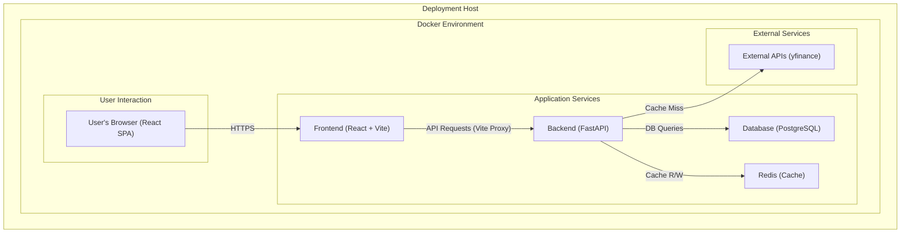

# Personal Portfolio Management System

### Final Project Summary

**Presenter:** Gemini Code Assist, Lead Software Engineer
**Date:** 2025-07-31

---

## Project Goal & Overview

*   **Goal:** To build a full-stack, containerized Personal Portfolio Management System (PMS).

*   **Overview:** A secure, reliable, and self-hostable platform for users to manage their investment portfolios, track performance, and gain insights into their financial health.

---

## Final Status: Pilot-Ready ✅

*   **Status:** The application is **stable and feature-complete** for its pilot release.

*   **Core Features:** All MVP features are implemented, including Authentication, User Management, Portfolio/Transaction tracking, and a dynamic Dashboard.

*   **Testing:** The application is fully covered by a multi-layered testing strategy:
    *   **Backend:** 51/51 unit & integration tests passing.
    *   **Frontend:** 56/56 component & integration tests passing.
    *   **End-to-End:** A stable Playwright suite validating all critical user flows.

---

## Technical Architecture

*   **Pattern:** Decoupled Client-Server (SPA)
*   **Backend:** Python with FastAPI
*   **Frontend:** JavaScript with React & Vite
*   **Database:** PostgreSQL
*   **Deployment:** Docker & Docker Compose

---

## Key Features Delivered

*   **Secure Authentication:** Initial admin setup, JWT-based sessions, and auto-logout on token expiration.

*   **Admin User Management:** Full CRUD capabilities for managing application users.

*   **Dynamic Dashboard:** Real-time summary of total value, top daily movers, and interactive charts for portfolio history and asset allocation.

*   **Full Portfolio & Transaction Management:** Create multiple portfolios, add transactions, and perform on-the-fly asset creation for unlisted tickers with backend validation.

---

## The Development Journey: Process & Key Learnings

*   **Initial State:** Faced a cascade of configuration, integration, and testing bugs.

*   **Evolved Process:** Adopted a rigorous **"Analyze -> Report -> Fix"** workflow.
    *   **Analyze:** Perform deep Root Cause Analysis (RCA) on full logs.
    *   **Report:** Formally document all bugs before fixing.
    *   **Fix:** Apply targeted fixes to the identified root cause.

*   **Key Learnings:**
    1.  **Configuration is King:** In a containerized environment, a single misconfigured variable can cause a cascade of failures.
    2.  **Test the Full Contract:** Most critical bugs were integration mismatches between the frontend and backend.
    3.  **E2E Testing is a Feature:** The E2E test environment requires the same level of engineering rigor as any user-facing feature.

---

## Multi-Layered Testing Strategy

*   **Backend (`pytest`):** 51 tests covering CRUD logic, API endpoints, and business logic validation.

*   **Frontend (`jest` & RTL):** 56 tests covering individual components, state management, and user interactions with mocked APIs.

*   **End-to-End (`Playwright`):** A stable, serial test suite validating critical user flows from initial setup to portfolio management.

---

## Live Demo

*(Demonstration of the application's key features)*

---

## Next Steps

*   **Advanced Asset Management:** Add support for FDs, RDs, PPF, NPS, Bonds, RSUs, ESPPs.
*   **Automated Data Import:** Implement file parsers for broker statements and MF CAS.
*   **Advanced Analytics:** Implement TWR, MWR, Sharpe Ratio, and other risk metrics.
*   **Goal Planning & Tracking:** Implement the goal definition and progress tracking module.

---

## Q&A

### Thank You