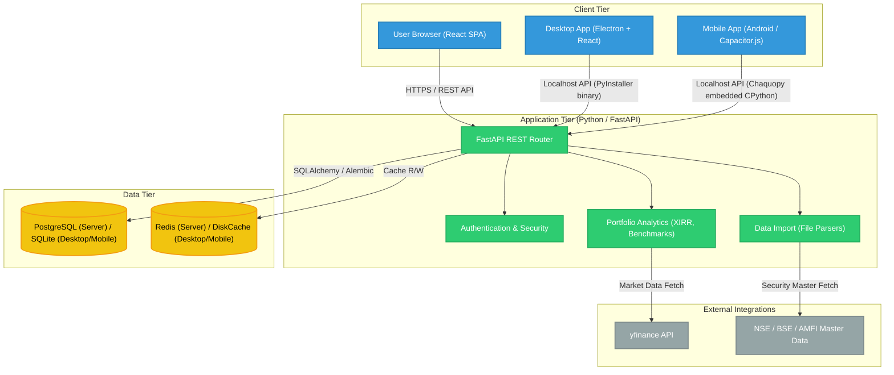
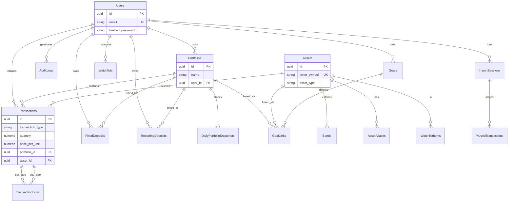
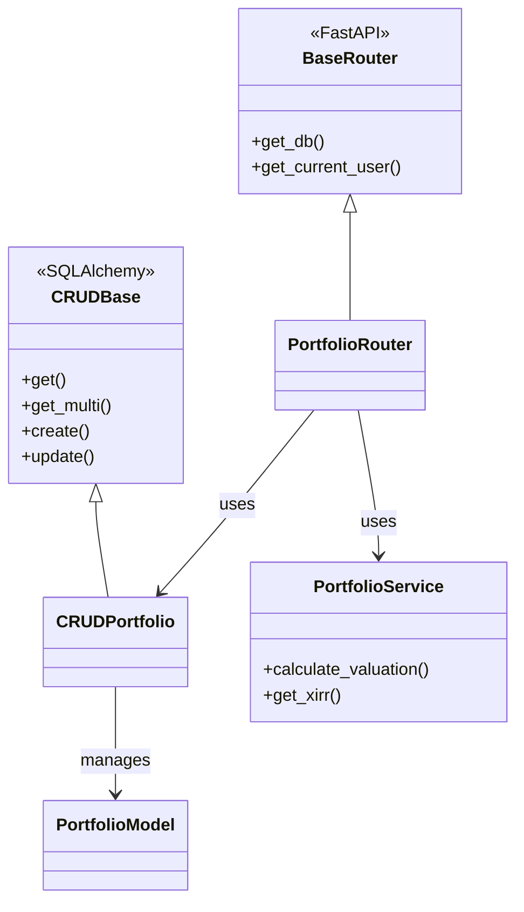
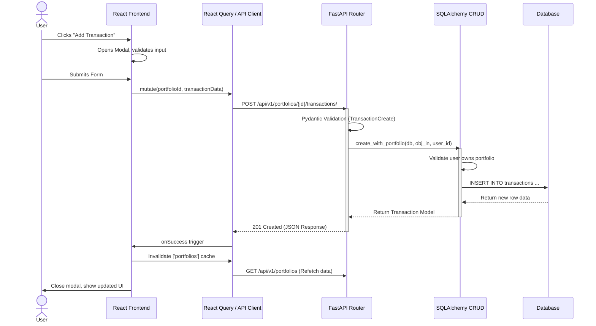
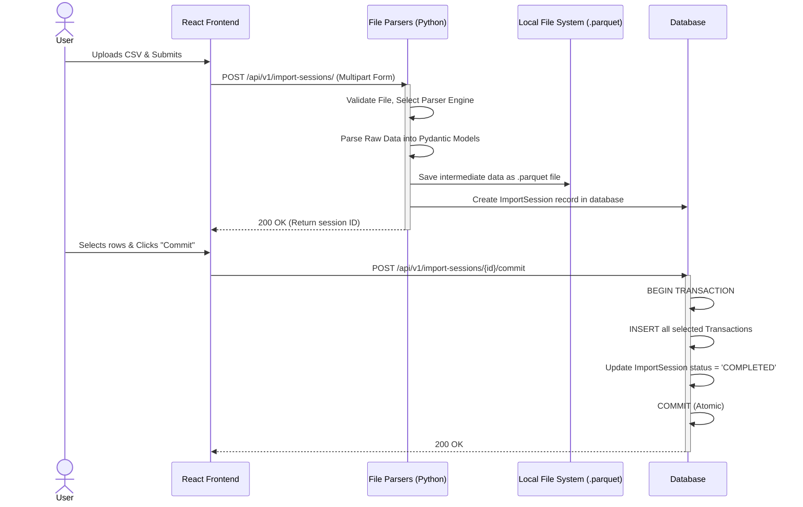

# Unified UML Design Documentation

This document serves as the single source of truth for the technical design and data models of the ArthSaarthi Personal Portfolio Management System.

---

## 1. System Architecture

The following diagram illustrates the high-level decoupled architecture supporting Server (Docker), Desktop (Electron), and Mobile (Android) deployments.

---

## 2. Entity-Relationship Diagram (ERD)

The core data model follows a strict multi-tenant ownership structure via the `user_id` foreign key.

---

## 3. Backend Class Architecture

The backend implements the **Repository Pattern** via SQLAlchemy CRUD classes, decoupled from the Pydantic-validated FastAPI routers.

---

## 4. Key Sequence Diagrams

### 4.1. Adding a Transaction

### 4.2. Data Import Pipeline

