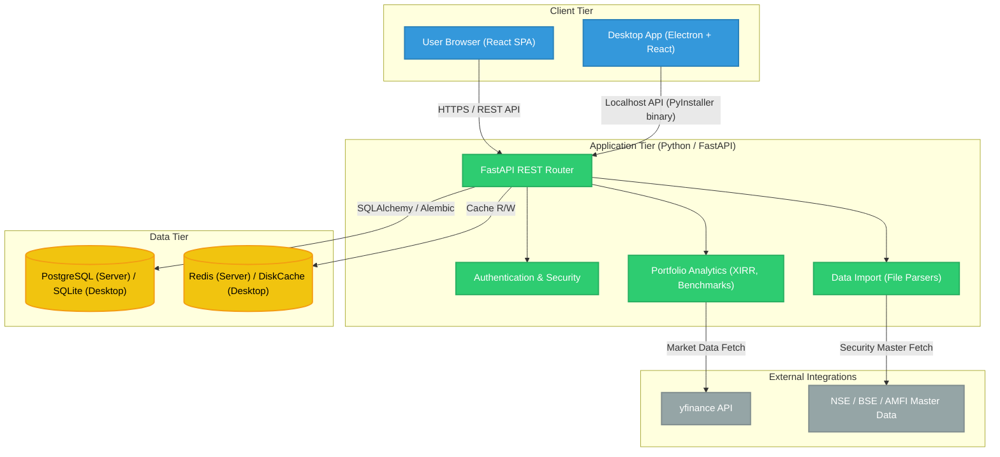
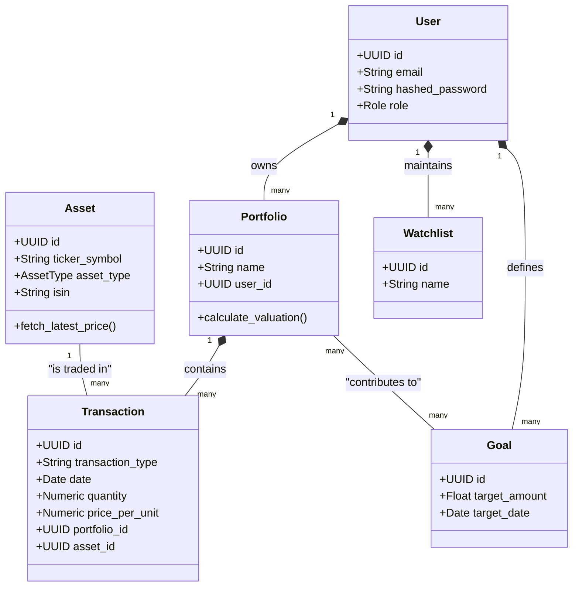
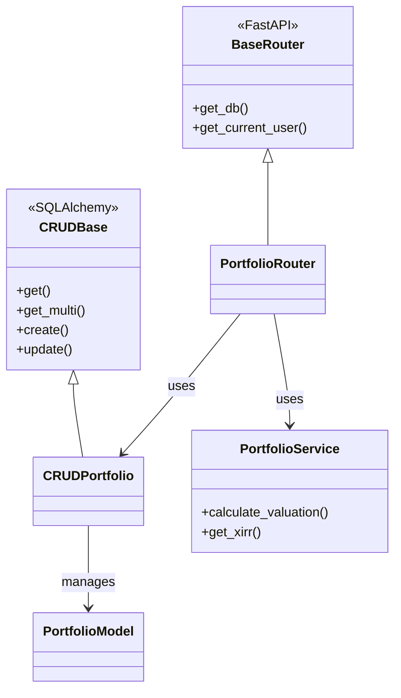
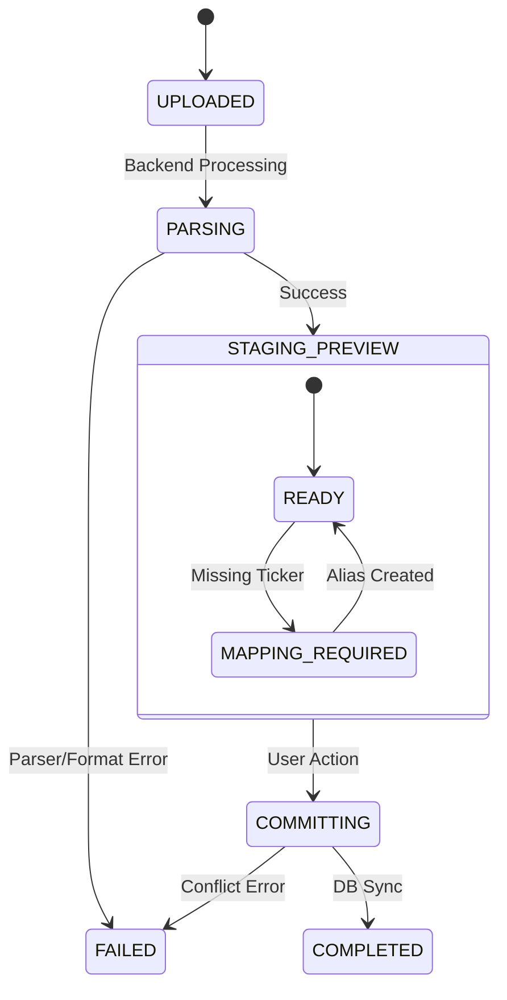
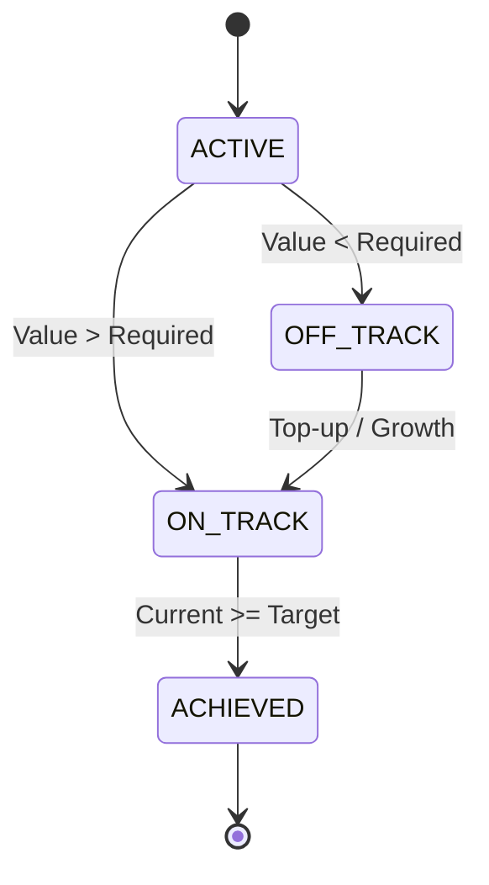
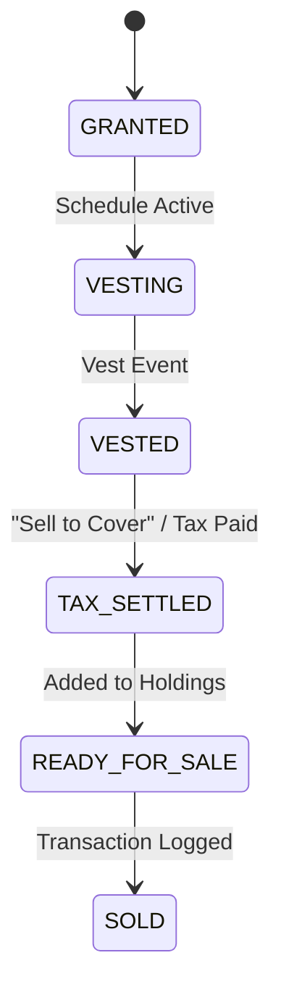
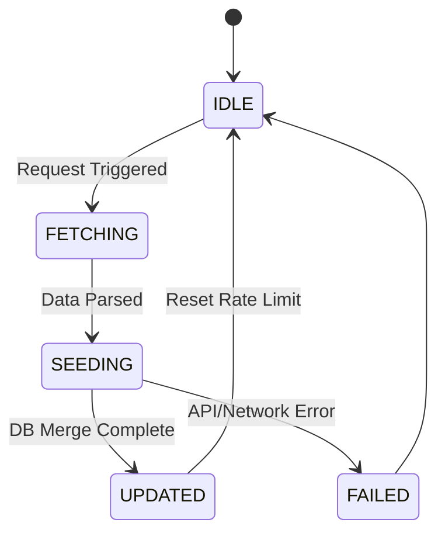

# UML Design Document

This document provides architectural UML diagrams for ArthSaarthi's system structure and core logic. For operational sequences, see [code_flow_guide.md](code_flow_guide.md).

## 1. System Architecture

The following diagram illustrates the high-level decoupled architecture supporting Server (Docker) and Desktop (Electron) deployments.



## 2. Core Domain Class Diagram

Defines the logical relationships between the primary entities in the system.



## 2b. Backend Class Architecture

The backend implements the **Repository Pattern** via SQLAlchemy CRUD classes, decoupled from the Pydantic-validated FastAPI routers.



## 3. Entity Lifecycle State Machines

Describes the behavioral states of complex system entities.

### A. Data Import Session


### B. Financial Goal Tracking


### C. RSU / ESPP Award Lifecycle


### D. Asset Master Seeder


## 4. Core Logic Activity Diagrams

### A. Capital Gains Processing
```mermaid
activityDiagram
    start
    :Fetch Asset Transactions;
    if (Specific ID Selected?) then (yes)
        :Match user-selected Lots;
    else (no)
        :Apply FIFO (First-In-First-Out);
    endif
    :Check Holding Period;
    if (Period > Threshold?) then (yes)
        :Calculate LTCG;
        :Apply Indexation (if Debt);
        :Apply Grandfathering (if 112A);
    else (no)
        :Calculate STCG;
    endif
    :Aggregate Realized P&L;
    stop
```

### B. Benchmark Simulation
```mermaid
activityDiagram
    start
    :Select Reference Index;
    if (Hybrid Selected?) then (yes)
        :Load Blended Weights (e.g. 50/50);
        :Fetch Multiple Index Navs;
    else (no)
        :Fetch Single Index Nav;
    endif
    :Overlay Risk-Free Baseline (if enabled);
    :Simulate Portfolio Cashflows into Benchmark;
    :Calculate Benchmark XIRR;
    stop
```

## 6. Entity-Relationship Diagram (Physical Schema)

The core data model follows a strict multi-tenant ownership structure via the `user_id` foreign key.


