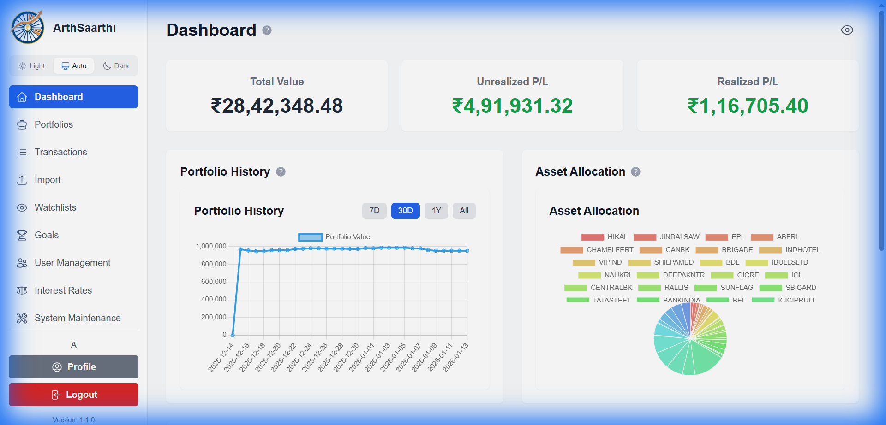
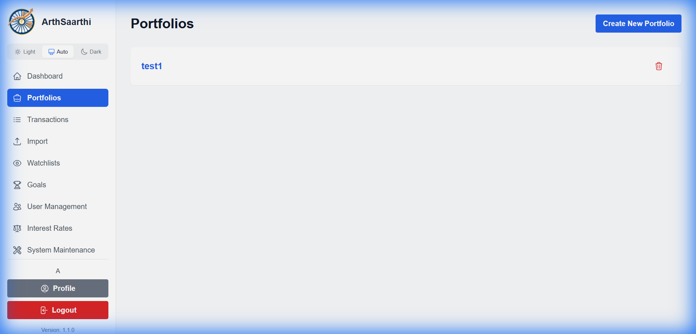
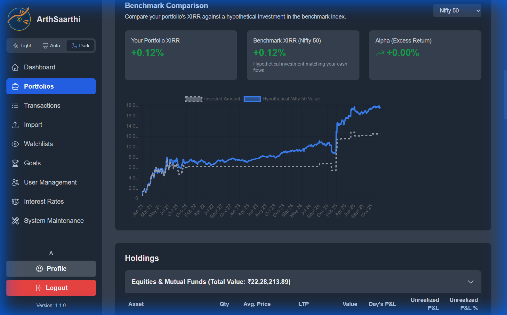
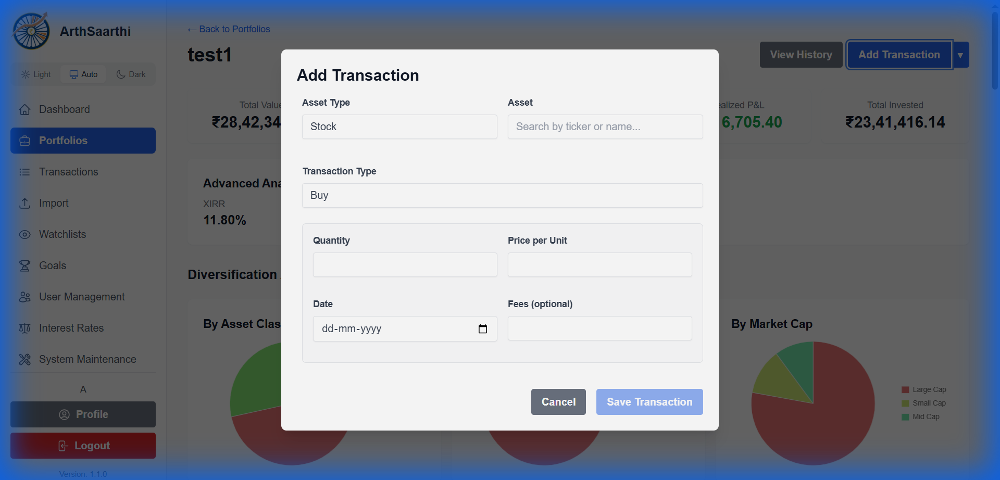
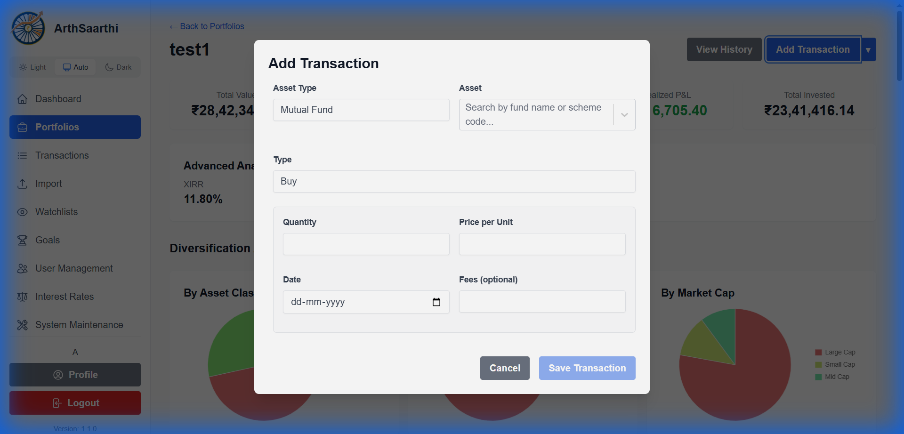
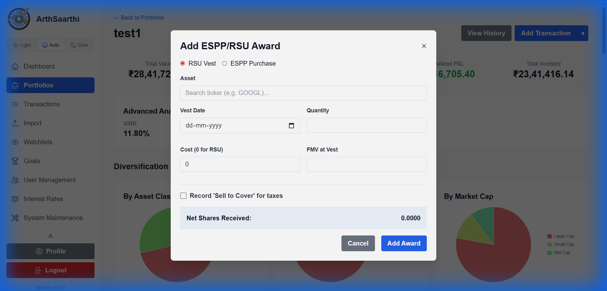
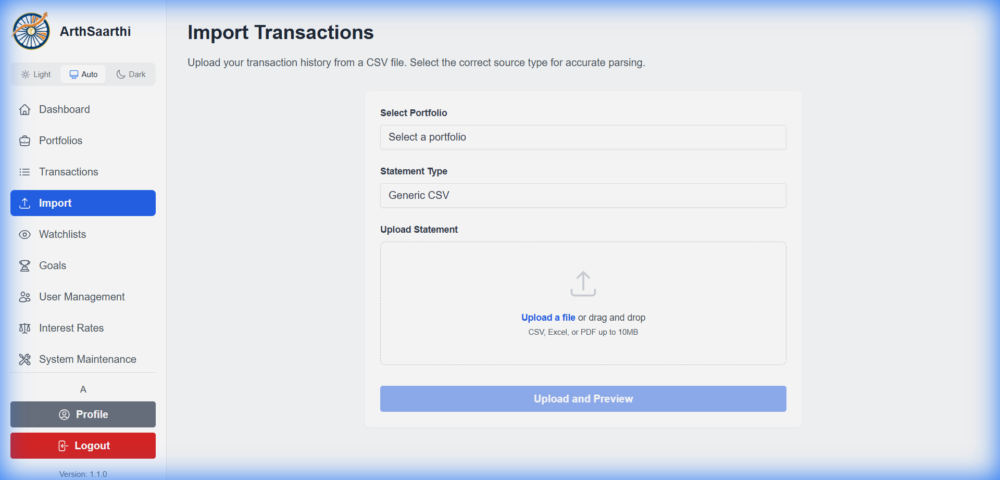
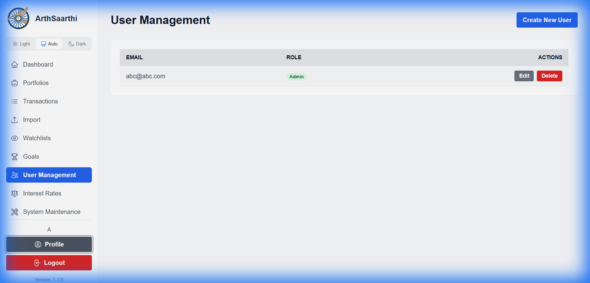
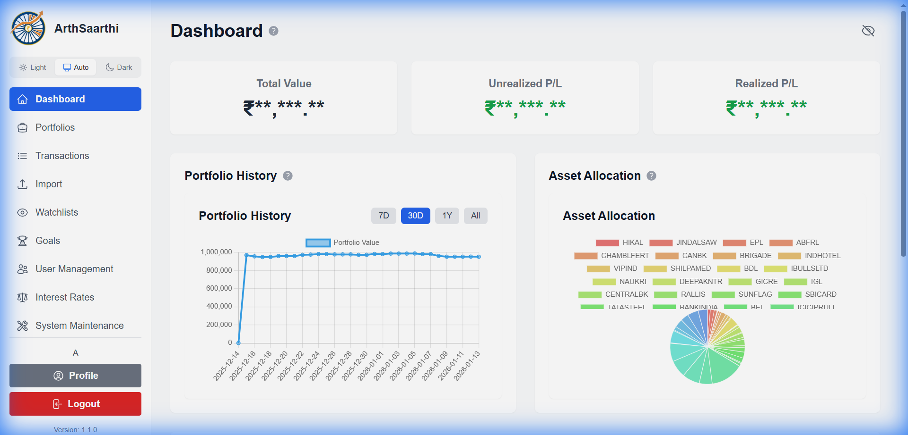

# ArthSaarthi - Comprehensive User Guide

**Your Personal Investment Portfolio Manager**

ArthSaarthi is a powerful web-based application designed to help you track, manage, and analyze your investment portfolios across multiple asset classes including stocks, mutual funds, bonds, fixed deposits, recurring deposits, PPF, and RSU/ESPP awards.

---

## Table of Contents

1. [Getting Started](#getting-started)
   - Desktop Mode vs Server Mode
   - First-Time Setup
2. [Dashboard Overview](#dashboard-overview)
   - Top Movers
3. [Managing Portfolios](#managing-portfolios)
   - Portfolio Analytics
   - Benchmark Comparison
4. [Adding Transactions](#adding-transactions)
   - Tax Lot Selection
   - Corporate Actions
   - Dividends & Income
   - Stock Splits & Bonus Shares
5. [Viewing Transaction History](#viewing-transaction-history)
6. [Import Data](#import-data)
   - Supported Formats (v1.1)
7. [Goals](#goals)
8. [Watchlists](#watchlists)
9. [Profile & Settings](#profile--settings)
   - Backup & Restore
10. [Admin Features](#admin-features)
11. [Themes & Privacy](#themes--privacy)

---

## Getting Started

### First-Time Setup

The first time you access the application, you will be greeted with a setup screen.

You **must** complete this form to create the first **administrator** account. This is the only time you will see this screen. After this account is created, all new users must be added by an administrator.

### Login

Access ArthSaarthi by navigating to the application URL. You'll be greeted with the login page where you can enter your credentials.

**To log in:**
1. Enter your **Email** address
2. Enter your **Password**
3. Click the **Login** button

> [!TIP]
> **Server Mode Users:** If you don't have an account, contact your system administrator to create one for you.
> **Desktop Mode Users:** You are the administrator of your local instance.

### Desktop Mode vs Server Mode

ArthSaarthi supports two deployment modes:

| Mode | Use Case | Database | Features |
|------|----------|----------|----------|
| **Desktop** | Personal use, single user | SQLite (local, encrypted) | All features except User Management |
| **Server** | Self-hosted, multiple users | PostgreSQL | Full features including User Management |

> [!NOTE]
> In Desktop Mode, your data is stored locally on your machine and encrypted. User Management is disabled since you're the only user.

---

## Dashboard Overview

After logging in, you'll be taken to the **Dashboard** - your central hub for portfolio insights.

### Key Dashboard Components

| Component | Description |
|-----------|-------------|
| **Total Value** | The combined current value of all your investments |
| **Unrealized P/L** | Profit or loss on holdings you still own |
| **Realized P/L** | Profit or loss from investments you've sold |
| **Portfolio History** | Interactive chart showing value changes over time (7D, 30D, 1Y, All) |
| **Asset Allocation** | Pie chart showing distribution across different stocks/assets |
| **Top Movers** | Your best and worst performing assets today |

### Top Movers

The **Top Movers** section highlights assets driving your portfolio's daily performance:
- **Top Gainers**: Assets with the highest positive change today
- **Top Losers**: Assets with the largest decline today

This helps you quickly identify what's moving your portfolio without checking each holding individually.

---

## Managing Portfolios

### Viewing Your Portfolios

Navigate to **Portfolios** from the sidebar to see all your investment portfolios.

Each portfolio card shows:
- Portfolio name
- **Delete** button to remove the portfolio

### Creating a New Portfolio

Click the **Create New Portfolio** button to add a new portfolio.

**Steps:**
1. Enter a **Portfolio Name** (e.g., "Retirement Fund", "Children's Education")
2. Click **Create Portfolio**

### Deleting a Portfolio

To delete a portfolio:
1. Navigate to **Portfolios** page
2. Click the **Delete** button on the portfolio card
3. Confirm the deletion when prompted

> [!CAUTION]
> Deleting a portfolio permanently removes all holdings and transactions within it. This action cannot be undone.

### Portfolio Detail View

Click on any portfolio to see its detailed holdings and performance.

The portfolio detail view shows:
- Summary cards (Invested, Current Value, Unrealized P/L, Realized P/L)
- Holdings breakdown by asset type (Stocks, Mutual Funds, etc.)
- Individual holding details with quantity, average price, and returns

### Holding Transaction History

Click on any holding to drill down into its complete transaction history.

This view displays:
- List of active BUY transactions (Tax Lots) constituting the current holding
- **Note:** For a complete history including closed SELL transactions, refer to the **Transactions** page.
- Date, quantity, price per unit, and total value
- CAGR and XIRR (Current & Historical) calculations
- Edit and delete options for each transaction

### Portfolio Analytics

Scroll down on the portfolio detail page to access comprehensive analytics for your investments.

#### Advanced Analytics & Diversification

**Advanced Analytics** includes:
- **XIRR**: Extended Internal Rate of Return - measures actual annualized returns
- **Sharpe Ratio**: Risk-adjusted return metric (calculated for Stocks and Mutual Funds only)

**Diversification Analysis** shows your portfolio distribution across:
- Asset Class
- Geography
- Market Cap (Large/Mid/Small)
- Sector
- Industry

#### Investment Style Classification

Understand whether your portfolio leans toward **Growth** or **Value** investing:

| Style | Characteristics | Typical Metrics |
|-------|-----------------|-----------------|
| **Growth** | High growth potential, reinvested earnings | High P/E, High P/B |
| **Value** | Undervalued, dividend-paying | Low P/E, Low P/B |
| **Blend** | Mix of both styles | Moderate ratios |

The Investment Style gauge analyzes your holdings based on:
- **P/E Ratio**: Price-to-Earnings ratio classification
- **P/B Ratio**: Price-to-Book ratio classification

> [!NOTE]
> Investment style is calculated for equity holdings only. Mutual funds, FDs, and other assets are excluded from this analysis.

#### Benchmark Comparison

Compare your portfolio's performance against market benchmarks like **Nifty 50**:
- **Your Portfolio XIRR**: Your actual returns
- **Benchmark XIRR**: What you'd have earned in the benchmark
- **Alpha (Excess Return)**: The difference - positive means you outperformed!

---

## Adding Transactions

### Stock Transactions

Click **Add Transaction** button in your portfolio and select **Stock** as the asset type.

**Required fields:**
- **Asset Type**: Stock
- **Transaction Type**: Buy or Sell
- **Stock Symbol**: Search by **Ticker** (e.g., RELIANCE) or **Company Name** (e.g., Reliance Industries)
- **Quantity**: Number of shares
- **Price per Unit**: Purchase/sale price
- **Transaction Date**: Date of transaction
- **Broker Fee** (Optional): Brokerage charges

### Selling with Tax Lot Selection

When selling shares, ArthSaarthi lets you choose which specific lots to sell from — crucial for tax optimization.

**Tax Lot Methods:**

| Method | Description | Best For |
|--------|-------------|----------|
| **FIFO** | First In, First Out - sells oldest shares first | Default method, simple |
| **LIFO** | Last In, First Out - sells newest shares first | Minimizing short-term gains |
| **Specific Lot** | Manually select which lots to sell | Maximum tax control |

**To use Specific Lot selection:**
1. When adding a SELL transaction, select **Specific Lot** as the method
2. View available lots with their purchase date, quantity, and cost basis
3. Select the lots you want to sell from
4. The system calculates capital gains based on your selection

> [!TIP]
> Selling shares with higher cost basis results in lower capital gains and less tax liability.

### Mutual Fund Transactions

For mutual fund investments, select **Mutual Fund** as the asset type.

**Required fields:**
- **Mutual Fund Name**: Search and select the fund
- **Transaction Type**: Buy/Sell/Corporate Action
- **Units**: Number of units
- **NAV**: Net Asset Value per unit
- **Transaction Date**: Date of transaction

### Bond Transactions

Track your bond investments by selecting **Bond** as the asset type.

### Fixed Deposit

Record your fixed deposits with maturity tracking.

**Key fields:**
- **Principal Amount**: Invested amount
- **Interest Rate**: Annual interest rate
- **Start Date** and **Maturity Date**
- **Bank/Institution Name**

### Recurring Deposit

Track your recurring deposits with monthly contribution tracking.

**Key fields:**
- **Institution Name**: Bank or post office
- **Monthly Installment**: Amount deposited each month
- **Interest Rate**: Annual interest rate
- **Tenure**: Number of months
- **Start Date**: When the RD began

### PPF Account

Manage your Public Provident Fund investments with automatic interest calculation.

**First-time setup:**
1. Select **PPF Account** as asset type
2. Enter institution name and account number
3. Set the account opening date
4. Add your first contribution amount and date
5. Click **Save** — this creates both the PPF asset and first transaction

**Adding subsequent contributions:**
- When you select PPF Account again, the system detects your existing account
- The form only asks for contribution amount and date
- New contributions are automatically linked to your existing PPF

**PPF Passbook View:**
- Click on your PPF holding to see a passbook-style statement
- View all contributions and system-calculated interest credits
- Interest is calculated using official government rates for each financial year

> [!NOTE]
> PPF interest rates are managed by administrators and updated quarterly based on government announcements.

### RSU/ESPP Awards

For employees with stock compensation, track RSU and ESPP awards via **Additional Actions > Add ESPP/RSU Award**.

**Key fields:**
- **Stock Symbol**: Your company's stock
- **Vest Date**: When shares were delivered
- **Quantity**: Number of shares vested
- **Fair Market Value (FMV)**: Stock price at vesting
- **Sell to Cover** (Optional): Shares sold to cover taxes

> [!TIP]
> The "Sell to Cover" option automatically records shares sold to pay withholding taxes — a common RSU vesting scenario.

### Editing & Deleting Transactions

**To edit a transaction:**
1. Click on the transaction in the holding drill-down or Transactions page
2. Modify any field (quantity, price, date, fees)
3. Click **Save** — all metrics recalculate automatically

**To delete a transaction:**
1. Click the **Delete** button on the transaction
2. Confirm the deletion
3. Portfolio values update accordingly

> [!WARNING]
> Deleting transactions cannot be undone. Consider editing instead if you need to correct an error.

### Corporate Actions

Record corporate actions that affect your holdings via **Additional Actions** menu:

**Mergers & Amalgamations:**
- Record when two companies merge (e.g., HDFC Bank merger)
- Enter the conversion ratio
- System adjusts holdings while preserving cost basis

**Demergers & Spin-offs:**
- Record when a company splits (e.g., Reliance-Jio Financial)
- Specify demerger ratio and cost allocation
- Creates new holding with proportional cost basis

**Ticker Renames:**
- Record when a stock symbol changes (e.g., VEDL → VEDANTA)
- Historical transactions remain linked correctly

### Dividends & Income

**Recording Dividends:**
- **Automatic:** Import your broker's dividend statement (e.g., Zerodha, ICICI) to bulk add all dividend income.
- **Manual:** Use "Add Transaction" → **Dividend** type to record individual payouts.
  > [!NOTE]
  > When adding manually, enter the **Total Amount** received (e.g., ₹500), NOT the amount per share.

**Tracking:**
- View total dividend income in **Advanced Analytics**
- Check asset drill-down to see dividends received per holding

### Stock Splits & Bonus Shares

**Stock Split:**
- Use **Corporate Actions** → **Stock Split**
- Enter the Split Ratio (e.g., 5:1 for 5 new shares for every 1 held)
- The system increases your quantity and reduces buy price proportionally

**Bonus Shares:**
- Use **Corporate Actions** → **Bonus Issue**
- Enter Ratio (e.g., 1:1 for 1 bonus share for every 1 held)
- This increases your total quantity; cost basis per share decreases accordingly

---

## Viewing Transaction History

Navigate to **Transactions** from the sidebar to see all transactions across portfolios.

**Features:**
- Filter by date range, asset type, or transaction type
- Sort by any column
- Quick edit or delete transactions
- Export transaction data

---

## Import Data

Bulk import your transaction history from CSV files or brokerage statements.

### Import Workflow

1. Navigate to **Import** from the sidebar
2. Select the **Portfolio** to import into
3. Choose the **Statement Type** matching your file format
4. Upload your file
5. Click **Upload and Preview**
6. Review parsed transactions:
   - **New Transactions**: Ready to import
   - **Requiring Mapping**: Need ticker mapping (see below)
   - **Duplicates**: Already exist in portfolio
   - **Invalid**: Errors preventing import
7. Select transactions to import
8. Click **Commit Transactions**

### Mapping Unrecognized Tickers

When the system doesn't recognize a ticker from your file:
1. Click **Map Ticker** next to the transaction
2. Search for the correct asset (e.g., "Infosys" for "INFY-BE")
3. Select the match and click **Create Alias**
4. Future imports will use this mapping automatically

### Supported Formats

| Category | Format | File Type |
|----------|--------|-----------|
| **Stocks** | Generic CSV | .csv |
| **Stocks** | Zerodha Contract Notes | .csv |
| **Stocks** | ICICI Direct Statements | .csv |
| **Mutual Funds** | MFCentral CAS | .xlsx |
| **Mutual Funds** | CAMS Statement | .xlsx |
| **Mutual Funds** | KFintech Statement | .pdf |
| **Mutual Funds** | Zerodha Coin | .xlsx |
| **Mutual Funds** | ICICI Securities MF | .xlsx |
| **Dividends** | Zerodha Dividend Statement | .xlsx |
| **Dividends** | ICICI DEMAT Dividend | .pdf |

> [!TIP]
> For Mutual Funds, download your Consolidated Account Statement (CAS) from MFCentral for the most complete data.

---

## Goals

Set and track your financial goals in the **Goals** section.

**Features:**
- Create goals with target amounts and dates
- Link portfolios to specific goals
- Track progress with visual indicators
- Get insights on whether you're on track

---

## Watchlists

Monitor stocks and funds you're interested in without adding them to your portfolio.

**Features:**
- Create multiple watchlists
- Add stocks/mutual funds to track
- View real-time price updates
- Quick add to portfolio when ready to invest

---

## Profile & Settings

Manage your account settings from the **Profile** page.

**Available settings:**
- Update profile information (name, email)
- Change password
- Configure notification preferences

### Backup & Restore

Protect your financial data with backup and restore capabilities.

**Creating a Backup:**
1. Go to **Profile** page
2. Click **Download Backup**
3. Save the JSON file to a secure location

The backup includes:
- All portfolios and holdings
- Complete transaction history
- Goals and watchlists
- Asset aliases and mappings

**Restoring from Backup:**
1. Go to **Profile** page
2. Click **Restore from Backup**
3. Select your backup JSON file
4. Confirm the restoration

> [!CAUTION]
> Restoring from backup **replaces all current data**. This cannot be undone. Always create a fresh backup before restoring.

---

## Admin Features

Admin users have access to additional management features.

### User Management

Create and manage user accounts from **Admin > User Management**.

**Capabilities:**
- Create new user accounts
- Assign roles (Admin, User)
- Edit or delete existing users

### Interest Rates

Configure system-wide interest rates for fixed deposits and other instruments.

### System Maintenance

Perform system maintenance tasks like data cleanup and cache refresh.

---

## Themes & Privacy

### Theme Toggle

Switch between **Light**, **Auto**, and **Dark** themes using the toggle in the sidebar.

| Light Theme | Dark Theme |
|-------------|------------|
|  |  |

### Privacy Mode

Click the **eye icon** next to the page title to toggle privacy mode, which hides sensitive financial data.

> [!TIP]
> Use privacy mode when viewing your portfolio in public spaces.

---

## Quick Reference

### Keyboard Shortcuts

| Shortcut | Action |
|----------|--------|
| `Esc` | Close modal dialogs |

### Navigation Menu

| Menu Item | Description |
|-----------|-------------|
| Dashboard | Overview of all portfolios |
| Portfolios | Manage individual portfolios |
| Transactions | View all transactions |
| Import | Bulk import data |
| Watchlists | Track potential investments |
| Goals | Financial goal tracking |

---

## Support

For questions or issues, please contact your system administrator.

---

*ArthSaarthi - Empowering Your Investment Journey* 🚀
