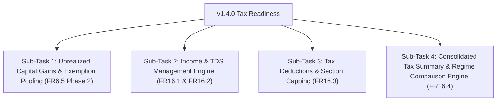
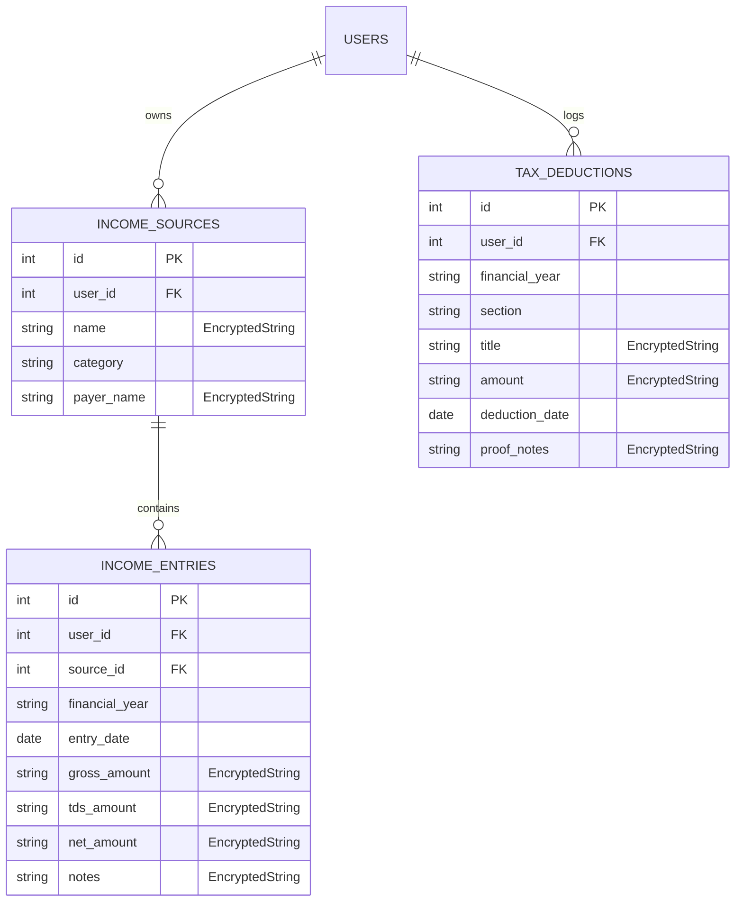

# Release v1.4.0 Detailed Architecture, Execution Plan & Technical Blueprint

**Release Name:** v1.4.0 — Tax Readiness & Full Financial Picture  
**Target Release Date:** Q3 2026  
**Primary Goal:** Provide ArthSaarthi with complete tax context (Unrealized Capital Gains, Income & TDS, Tax Deductions 80C/80D, and Old vs New Tax Regime Estimation), enabling full tax readiness and laying foundations for AI Tax-Loss Harvesting.

---

## 1. Modular Sub-Tasks Breakdown

Release v1.4.0 is structured into **4 sequential, modular sub-epics**:



### Sub-Task 1: Unrealized Capital Gains & Section 112A Exemption Pooling (Issue #516)
*   **Backend:** Tax lot unrealized gain engine, holding period calculator, Section 112A exemption pool (₹1,25,000 threshold), and API `/api/v1/tax/unrealized-gains`.
*   **Frontend:** Unrealized capital gains summary card, holding tax-lot drilldown modal, Section 112A progress meter, Privacy Mode masking.

### Sub-Task 2: Income & TDS Management Engine (Issue #517)
*   **Backend:** `IncomeSource` and `IncomeEntry` SQLAlchemy models, `EncryptedString` integration for sensitive notes/payer names, CRUD, schemas, Alembic migration, and `/api/v1/income/*` APIs.
*   **Frontend:** Dedicated `IncomePage.tsx`, income source configuration modal, income entry logger form, card/table dual layout.

### Sub-Task 3: Tax Deductions & Chapter VI-A Limits (Issue #518)
*   **Backend:** `TaxDeduction` SQLAlchemy model, statutory section ceiling caps (80C: ₹1.5L, 80D: ₹25k/50k, 80CCD: ₹50k, 80TTA/TTB), CRUD, schemas, and `/api/v1/tax/deductions/*` APIs.
*   **Frontend:** `DeductionsPage.tsx`, interactive statutory limit progress meters, deduction entry form modal, auto-linking suggestions for PPF/ELSS.

### Sub-Task 4: Consolidated Tax Summary & Regime Engine (Issue #519)
*   **Backend:** Unified aggregation pipeline, Old Tax Regime vs New Tax Regime (Section 115BAC) tax estimation engine, PDF/CSV report generation, and `/api/v1/tax/summary` APIs.
*   **Frontend:** `TaxReadinessDashboard.tsx`, Old vs New Regime side-by-side comparison card, statutory non-advisory legal disclaimer banner, export modal.

---

## 2. Backend vs Frontend Architecture & Responsibilities

### Backend Responsibilities
1.  **Data Isolation & Security:** IDOR protections across all income, deduction, and unrealized tax endpoints (`user_id` authorization filters).
2.  **Tax Math Engines:**
    *   `UnrealizedTaxService`: Calculates FIFO-based unrealized STCG/LTCG across equity, debt, foreign, and mutual fund assets using live market prices from `FinancialDataService`.
    *   `TaxRegimeService`: Computes tax liability under Old Regime vs New Regime (Section 115BAC) including standard deduction (₹50k/₹75k), rebate under 87A, and 4% Health & Education Cess.
3.  **PDF/CSV Generators:** Report builders utilizing `reportlab` or clean HTML-to-PDF/CSV formatters with mandatory disclaimer text.

### Frontend Responsibilities
1.  **Responsive Dual-Layouts:** Desktop table view transitioning to touch-friendly card layouts on mobile screens (`< 1024px`).
2.  **Privacy Mode Integration:** All monetary values wrapped in `usePrivacySensitiveCurrency` to support full data masking (`***`).
3.  **State Management & Micro-Interactions:** Real-time progress bar recalculations during form inputs without unnecessary page re-renders.

---

## 3. Test Plan & Corner Cases

### 3.1. Edge & Corner Cases to Handle
1.  **Zero/Negative Unrealized Gains:** Holdings currently in loss (Tax-Loss Harvesting candidates). Ensure negative values reduce total unrealized gain calculations without causing zero-division or invalid log warnings.
2.  **Section 112A Partial Exemption Headroom:** When realized LTCG has already consumed ₹1,00,000 of the ₹1,25,000 exemption, remaining headroom for unrealized gains must reflect exactly ₹25,000.
3.  **TDS Exceeding Gross Amount:** Input validation on income entry forms preventing `tds_amount > gross_amount`.
4.  **Deduction Capping Exceeded:** Logging ₹2,50,000 under Section 80C must display total logged investments as ₹2.5L, but cap eligible tax deduction at statutory limit of ₹1,50,000.
5.  **Multi-Currency Foreign Gains/Income:** Income received in foreign currencies (e.g. USD salary/dividend) converted to INR using historical FX rates on transaction date.
6.  **Leap Year & FY Boundaries:** Financial year date ranges (April 1 to March 31 of following year) handling February 29 dates correctly.

### 3.2. Manual Testing Matrix
*   [ ] Test creating, editing, and deleting Income Sources and Entries across desktop and mobile browsers.
*   [ ] Test logging Section 80C and Section 80D tax deductions and verify visual progress bar capping.
*   [ ] Test toggling Privacy Mode on Dashboard and verifying all income, deduction, and tax summary cards mask values.
*   [ ] Test generating PDF/CSV Tax Summary Reports and verify legal disclaimer presence.

---

## 4. Test Automation Plan (Backend, Frontend, E2E)

```text
+-------------------------------------------------------------------------------+
|                       AUTOMATED TEST SUITE MATRIX                             |
+------------------------------------+------------------------------------------+
| Layer                              | Scope & Target Files                     |
+------------------------------------+------------------------------------------+
| Backend Integration (Postgres)     | app/tests/api/v1/test_income.py          |
|                                    | app/tests/api/v1/test_tax_deductions.py  |
|                                    | app/tests/api/v1/test_unrealized_tax.py  |
|                                    | app/tests/api/v1/test_tax_summary.py     |
+------------------------------------+------------------------------------------+
| Backend Embedded (SQLite / Android)| app/tests/api/v1/test_income_sqlite.py   |
|                                    | app/tests/api/v1/test_tax_sqlite.py     |
+------------------------------------+------------------------------------------+
| Frontend Unit / Component (Jest)   | src/pages/IncomePage.test.tsx            |
|                                    | src/pages/DeductionsPage.test.tsx        |
|                                    | src/components/TaxSummaryCard.test.tsx   |
+------------------------------------+------------------------------------------+
| End-to-End (Playwright)            | tests/tax-readiness-workflow.spec.ts     |
+------------------------------------+------------------------------------------+
```

---

## 5. UX & UI Specifications

1.  **Color Tokens & Visual Hierarchy:**
    *   Exemption Headroom & Deductions: Emerald/Green (`#10b981`) for available headroom, Slate for neutral totals.
    *   Tax Liability Cards: Soft Amber/Orange (`#f59e0b`) for tax warnings, Rose/Red (`#ef4444`) for net tax payable.
2.  **Non-Advisory Banner:** Distinct light blue/indigo informational notice box fixed at the top of Tax Readiness pages.
3.  **Micro-animations:** Smooth progress meter transitions when logging or updating tax deductions.

---

## 6. Database Schema & Security Encryption (`EncryptedString`)

To protect user financial privacy on local desktop (PyInstaller) and mobile (Android SQLite) databases, all PII and financial ledger fields are stored using `EncryptedString` (AES-256-GCM encryption key managed by `KeyManager`).



### Encryption Column Matrix
*   `IncomeSource.name`, `IncomeSource.payer_name` $\rightarrow$ `EncryptedString`
*   `IncomeEntry.gross_amount`, `IncomeEntry.tds_amount`, `IncomeEntry.net_amount`, `IncomeEntry.notes` $\rightarrow$ `EncryptedString`
*   `TaxDeduction.title`, `TaxDeduction.amount`, `TaxDeduction.proof_notes` $\rightarrow$ `EncryptedString`

---

## 7. Documentation Update Roadmap

Upon completing v1.4.0 features, the following core documentation files MUST be updated per Playbook rules:

1.  **`README.md`**: Update feature list to highlight Tax Readiness, Income/TDS Ledger, and Old vs New Tax Regime Estimation.
2.  **`docs/code_flow_guide.md` & `docs/architecture.md`**: Document `UnrealizedTaxService`, `TaxRegimeService`, and new DB models (`IncomeSource`, `IncomeEntry`, `TaxDeduction`).
3.  **`docs/workflow_history.md`**: Log complete execution history, API endpoints added, and test suite verification runs.
4.  **`docs/troubleshooting.md`**: Add troubleshooting notes for encryption key loading errors or SQLite decimal sanitization.
5.  **`docs/project_handoff_summary.md`**: **CRITICAL.** Update section 1 and 2 to reflect Release Candidate v1.4.0 readiness and updated test suite totals.
6.  **`docs/requirements.md`**: Mark `FR6.5.3`, `FR16.1`, `FR16.2`, `FR16.3`, and `FR16.4` as `✅ Done`.

---

## 8. Data Sources & Tax Engine Benchmarks

1.  **Live & Historical Market Prices:** Upstox V3 historical candles (`FinancialDataService`) as primary, `yfinance` as fallback for foreign/unmapped assets.
2.  **Foreign Exchange Rates:** Historical FX rates (USD/INR) from `FinancialDataService` for foreign income/gains consolidation.
3.  **Excel Tax Engine Benchmark (`local/TaxCalc_2027.xlsx`):** Benchmarks ArthSaarthi's salary calculation engine, HRA formula (Sec 10(13A)), perquisites, and Old vs New Tax Regime outputs against `local/TaxCalc_2027.xlsx` and historical calculators (`TaxCalc_2022.xlsx` to `TaxCalc_2027.xlsx`).
4.  **Versioned Statutory Tax Rules Table (`TaxRulesRegistry`):**
    *   `backend/app/core/tax_rules_registry.py` storing year-over-year tax brackets, standard deductions, Section 87A rebate thresholds, HRA rules, and Section 80C/80D caps per Financial Year.
    *   Section 112A LTCG Equity Exemption: ₹1,25,000 / FY
    *   Section 80C Ceiling: ₹1,50,000 / FY
    *   Section 80D Ceiling: ₹25,000 (Self) / ₹50,000 (Senior Parents)
    *   Section 80CCD(1B) Ceiling: ₹50,000 / FY
    *   Standard Deduction: ₹50,000 (Old) / ₹75,000 (New)

---

## 9. Files & APIs to Create / Update

### Backend Files to Create/Update
*   `backend/app/models/income.py` (New)
*   `backend/app/models/tax_deduction.py` (New)
*   `backend/app/schemas/income.py` (New)
*   `backend/app/schemas/tax_deduction.py` (New)
*   `backend/app/schemas/tax_summary.py` (New)
*   `backend/app/crud/crud_income.py` (New)
*   `backend/app/crud/crud_tax_deduction.py` (New)
*   `backend/app/services/unrealized_tax_service.py` (New)
*   `backend/app/services/tax_regime_service.py` (New)
*   `backend/app/api/v1/endpoints/income.py` (New)
*   `backend/app/api/v1/endpoints/tax_deductions.py` (New)
*   `backend/app/api/v1/endpoints/tax_summary.py` (New)
*   `backend/app/api/v1/router.py` (Update router registrations)
*   `backend/alembic/versions/xxxx_v1_4_0_tax_tables.py` (New migration)

### Frontend Files to Create/Update
*   `frontend/src/types/income.ts` (New)
*   `frontend/src/types/tax_deduction.ts` (New)
*   `frontend/src/services/incomeService.ts` (New)
*   `frontend/src/services/taxService.ts` (New)
*   `frontend/src/pages/IncomePage.tsx` (New)
*   `frontend/src/pages/DeductionsPage.tsx` (New)
*   `frontend/src/pages/TaxSummaryDashboard.tsx` (New)
*   `frontend/src/components/UnrealizedGainsModal.tsx` (New)
*   `frontend/src/components/RegimeComparisonCard.tsx` (New)
*   `frontend/src/components/NavBar.tsx` (Update navigation links)

---

## 10. Mobile-Friendly UI Considerations

1.  **Safe-Area Compliance:** All new pages use `pt-safe` and `pb-safe` classes to clear mobile notch and native navigation bars on Android/Capacitor.
2.  **Touch Targets & Keypads:** Form inputs use minimum `44px` touch targets. Numeric input fields specify `type="number"` and `inputMode="decimal"` for native numeric keypads.
3.  **Responsive Layout Breakpoints:** Cards collapse to 1 column on screens $< 1024\text{px}$. Scrollable tables wrap in touch-scroll wrappers with visual gradient indicators.

---

## 11. Android Compatible Python Libraries

To ensure 100% compatibility with the **Chaquopy Android Python runtime** (SQLite/DiskCache mode):

*   ❌ **NO Compiled C-Extensions:** Do NOT introduce external libraries requiring compiled native C/Rust extensions (e.g. `pyxirr`, `scipy`, `pandas` binaries).
*   ✅ **Pure Python Implementation:**
    *   Use Python `decimal.Decimal` and `datetime` standard library for all financial calculations.
    *   Use standard `math` and Newton-Raphson iteration for internal return calculations.
    *   Use `pydantic` schemas compatible with both Pydantic v1 (Android) and Pydantic v2 (Server) via `backend/app/schemas/pydantic_compat.py`.
